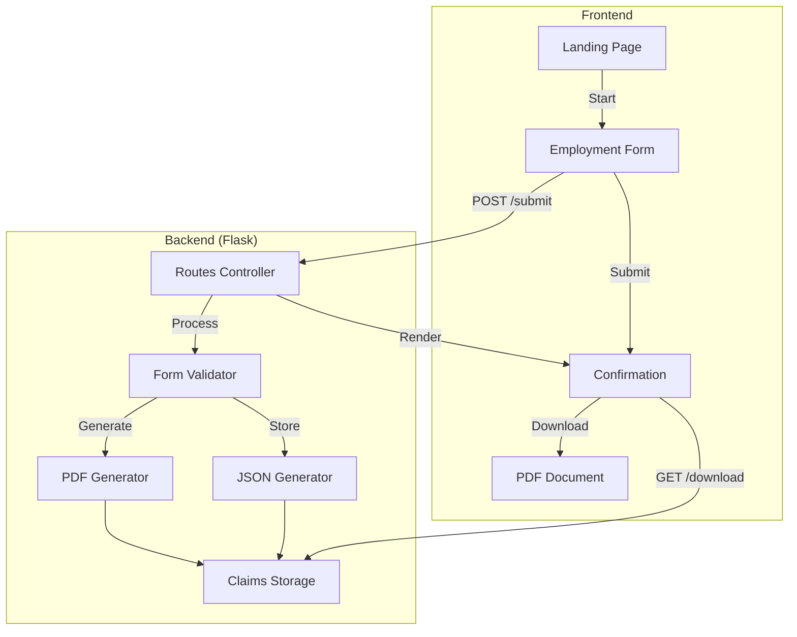

# Trua Verify Architecture Diagram

## System Architecture

The Trua Verify system follows a traditional web application architecture with a Flask backend and HTML/JavaScript/CSS frontend. The diagram below illustrates the high-level architecture:

## Key Components

### Frontend Components

1. **Landing Page**: Introduces the verification process and provides the entry point for candidates.
   - Displays welcome message and explanation
   - Contains "Start Verification" button

2. **Employment Form**: The main interface for data collection.
   - Personal information section
   - Dynamic timeline entry section
   - Digital signature capture
   - Form validation

3. **Confirmation Page**: Confirms successful submission and provides next steps.
   - Success message
   - PDF download link
   - Instructions for the candidate

### Backend Components

1. **Routes Controller**: Handles HTTP requests and routing.
   - Landing page route (`/verify`)
   - Form page route (`/form`)
   - Submission processing route (`/submit`)
   - PDF download route (`/download/<filename>`)

2. **Form Validator**: Ensures submitted data meets requirements.
   - Validates required fields
   - Verifies timeframe coverage
   - Checks date consistency

3. **PDF Generator**: Creates PDF documents from claim data.
   - Formats claim data into a structured document
   - Embeds the digital signature
   - Generates a standardized PDF file

4. **JSON Generator**: Creates JSON representation of claim data.
   - Structures data for programmatic access
   - Ensures consistent format for potential API use

5. **Claims Storage**: Manages persistent storage of claims.
   - Stores both PDF and JSON formats
   - Uses tracking ID and date for unique filenames

## Technical Stack

- **Frontend**: HTML, CSS, JavaScript
  - Signature capture using signature_pad.js library
  - Client-side validation

- **Backend**: Python/Flask
  - ReportLab for PDF generation
  - JSON for data serialization

- **Storage**: File system-based storage
  - Claims directory for PDF and JSON files
  - Naming convention: `truaverify_<tracking_id>_<date>.<extension>`

## Request Flow

1. Candidate accesses the system via a URL with tracking ID and years parameters
2. System displays the landing page with introduction
3. Candidate proceeds to the form page
4. Candidate completes the form and signs
5. Form is submitted to the server
6. Server validates the data and generates documents
7. Server returns confirmation page
8. Candidate downloads the PDF document
9. Candidate sends the PDF to the verifier (outside the system)

## Future Architecture Considerations

The current architecture could be extended to include:

1. **Database Storage**: Replace file-based storage with a database for better querying and management
2. **Verifier Portal**: Add a dedicated interface for verifiers
3. **Authentication System**: Implement user accounts and authentication
4. **API Layer**: Create a formal API for system integration
5. **Cloud Storage**: Move document storage to cloud services for better scalability