# Trua Verify Collection Flow

This document outlines the detailed collection flow for the Trua Verify system, including the Collection Key concept that drives the dynamic form behavior.

## Collection Flow Diagram

```mermaid
flowchart TD
   %% Initial Access
   A[Candidate] -->|Accesses| B[Invitation URL]
   B -->|Loads| C[Landing Page]
   C -->|Navigates to| D[Collection Wizard]
   %% Callout: Candidate starts via a unique URL; landing page explains process
   %% UX Note: Multi-step wizard with progress bar (e.g., 'Step X of Y'); 'Next'/'Back' buttons


   %% Dynamic Steps Driven by Collection Key
   D -->|Collects| E[Collection Key e.g. en-EPA-DTB-R3-EN2-E-P-W]
   E -->|Parses| F[Parse Key: Sets Language e.g. en and Facets e.g. EPA-DTB-R3-EN2-E-P-W]
   F -->|Uses Facets for Personal, Consents, Residence, Employment, Education, etc.| F1{Determine Initial Step}
   %% Callout: Collection Key is a hyphen-separated string (e.g., "en-EPA-DTB-R3-EN2-E-P-W")
   %% Language (2 chars) sets UI language; 7 facets define verification requirements
   
   %% Dynamic Initial Step
   F1 -->|Default Key| G
   F1 -->|Custom Key & Bit 6=1| P
   F1 -->|Custom Key & Bit 5=1| N
   F1 -->|Custom Key & Bit 4=1| L
   F1 -->|Custom Key & Any Bit 1-3=1| I
   %% Callout: System can start at any enabled step based on collection key
   %% This allows testing specific sections without going through earlier steps


   %% Core Data Collection
   subgraph Core Steps [Always Included Steps]
       F1 -->|Default: Step: Enters| G[Personal Information]
       %% Callout: Captures claimant details (Bit 0 always 1)
       %% Fields: Full Name, DOB, Email, Phone, SSN (optional)
       %% UX: Text inputs; DOB as date picker; Email validation; 'Required' asterisk
       %% UX: Error: 'Please fill all required fields' if incomplete
   end


   %% Consent Capture Section
   subgraph Consent [Optional Consent Capture]
       G -->|Evaluates Bits 1-3| H{Consent Capture Required?}
       H -->|No Bits 1-3 = 0| K
       H -->|Yes Any Bit 1-3 = 1| I[Consent Capture]
       I -->|Evaluates Bit 1| I1{Driver's License Consent Required?}
       I1 -->|Yes Bit 1 = 1| I2[Capture Driver's License Consent]
       I1 -->|No Bit 1 = 0| I3
       I2 --> I3
       I3 -->|Evaluates Bit 2| I3a{Drug Test Consent Required?}
       I3a -->|Yes Bit 2 = 1| I4[Capture Drug Test Consent]
       I3a -->|No Bit 2 = 0| I5
       I4 --> I5
       I5 -->|Evaluates Bit 3| I5a{Biometric Consent Required?}
       I5a -->|Yes Bit 3 = 1| I6[Capture Biometric Consent]
       I5a -->|No Bit 3 = 0| K
       I6 --> K
       %% Callout: Collects consents as yes/no flags + dates/notes (Bits 1-3)
       %% Fields: Granted (checkbox), Date (auto), Notes (text)
       %% UX: Checkboxes with labels (e.g., 'I consent to DMV check'); Shown if bit = 1; Error: 'Consent required' if unchecked
   end
  
   %% Education Section
   subgraph Education [Optional Education Details]
       K{Education Required?}
       K -->|No Bit 4 = 0| M
       K -->|Yes Bit 4 = 1| L[Education]
       L -->|Enters| L1[Highest Level Attained]
       L1 -->|Evaluates| L2{College or Higher?}
       L2 -->|No| M
       L2 -->|Yes| L3[Enter Degree Details]
       L3 --> M
       %% Callout: Collects education data (Bit 4)
       %% Fields (L1): Highest Level (dropdown: None, High School, Associate's, Bachelor's, Master's, Doctorate)
       %% Fields (L3): School Name, Degree Level, Title, Major, Award Date, GPA (optional)
       %% UX: L1 required; L3 shown if Bachelor's+; Error: 'Enter degree details' if incomplete
   end
  
   %% Professional License Section
   subgraph Licenses [Optional Professional Licenses]
       M{Professional Licenses Required?}
       M -->|No Bit 5 = 0| O
       M -->|Yes Bit 5 = 1| N[Professional Licenses]
       N -->|Enters| N1[License Entry]
       N1 -->|Evaluates| N2{More Licenses?}
       N2 -->|Yes| N
       N2 -->|No| O
       %% Callout: Collects one or more licenses (Bit 5)
       %% Fields (N1): Category (dropdown), Type (dropdown/text), Class (optional text), Identifier (text), Identifier Descriptor (optional text), Issuer (text), Issue Date (date), Expiration Date (date), Status (dropdown), Notes (optional text)
       %% UX: 'Add Another License' button; 'Done' to proceed; Error: 'Complete all required fields'; List entered licenses below form
   end
  
   %% Residence History Section
   subgraph Residence [Optional Residence History]
       O{Residence History Required?}
       O -->|No Bit 6 = 0| Q
       O -->|Yes Bit 6 = 1| P[Residence History]
       P -->|Enters| P1[Address Entry]
       P1 -->|Validates with Bits 7-9| P2{Is Timeline Complete?}
       P2 -->|No| P
       P2 -->|Yes| Q
       %% Callout: Collects address history for timeline (Bit 6 + Bits 7-9: 0=1, 3=3 yrs, 5=5 yrs, 7=7 yrs, 10=10 yrs)
       %% Fields (P1): Address, City, State, ZIP, Country, Start Date, End Date (optional), Is Current (checkbox)
       %% UX: 'Add Address' button; Error: 'Add more to meet X years'; Show total (e.g., '4 of 5 years') until complete
   end
  
   %% Employment History Section
   subgraph Employment [Optional Employment History]
       Q{Employment History Required?}
       Q -->|No Bit 10 = 0| S
       Q -->|Yes Bit 10 = 1| R[Employment History]
       R -->|Enters| R1[Job Entry]
       R1 -->|Validates with Bits 11-13| R2{Is Timeline Complete?}
       R2 -->|No| R
       R2 -->|Yes| S
       %% Callout: Collects job history for timeline (Bit 10 + Bits 11-13: 0=1, 3=3 yrs, 5=5 yrs, 7=7 yrs, 10=10 yrs)
       %% Fields (R1): Type (Job/Unemployed), Company, Position, City, State, Start Date, End Date (optional), Is Current (checkbox), Description, Contact Name, Contact Info
       %% UX: 'Add Job' button; Error: 'Add more to meet X years'; Show total (e.g., '3 of 5 years') until complete
   end


   %% Finalization
   subgraph Final Steps [Completion and Output]
       S[eSignature/Summary Page] -->|Submits| T[Form Submission]
       T -->|Generates| U[Generate Artifacts]
       U -->|Creates| V[JSON Manifest]
       U -->|Creates| W[PDF Attestation]
       U -->|Renders| X[Confirmation Page]
       X -->|Downloads| W
       W -->|Sent to| Y[Output Destination]
       %% Callout: eSignature confirms data; generates JSON/PDF outputs (Bit 0 always 1)
       %% Fields (S): Signature (draw/input), Date (auto-filled)
       %% UX: Summary table of all data; 'Sign & Submit' button; X shows 'Download PDF' link; Success: 'Submission complete!'
       %% UX: Error: 'Review and sign all required fields' if incomplete
   end


   %% Styling
   style G color:#FFFFFF, fill:#AA00FF, stroke:#AA00FF
   style S color:#FFFFFF, fill:#00C853, stroke:#00C853
   style U color:#FFFFFF, fill:#2962FF, stroke:#2962FF
```



## Collection Key Concept

The Collection Key is a hyphen-separated string that drives the dynamic behavior of the form. For example: `en-EPA-DTB-R3-EN2-E-P-W`

### Key Structure

The collection key follows this format: `[language]-[personal]-[consents]-[residence]-[employment]-[education]-[proLicense]-[signature]`

1. **Language** (2 characters)
   - Sets the UI language (e.g., "en" for English, "es" for Spanish)
   - Examples: "en", "es", "fr", "it"

2. **Personal Info** (1+ characters)
   - Defines what personal information is required
   - Values:
     - N: Disabled (skips to next enabled step)
     - E: Email only
     - P: Phone only
     - M: Full name only
     - A: Name alias only
     - Combinations: EP, EPA, EPM, EPMA, etc.
     - Invalid: Defaults to P (phone only)

3. **Consents Required** (1+ characters)
   - Defines which consents are required
   - Values:
     - N: No consents
     - D: Driver license consent
     - T: Drug test consent
     - B: Biometric consent
     - Combinations: DT, DB, TB, DTB
     - Invalid: Defaults to N

4. **Residence History** (2 characters)
   - Defines if residence history is required and for how many years
   - Values:
     - N: Disabled
     - R1: 1 year
     - R3: 3 years
     - R5: 5 years
     - Invalid: Defaults to R1 if enabled

5. **Employment History** (2-3 characters)
   - Defines if employment history is required and for how many years/employers
   - Values:
     - N: Disabled
     - Years mode: E1 (1 year), E3 (3 years), E5 (5 years)
     - Employers mode: EN1 (1 employer), EN2 (2 employers), EN3 (3 employers)
     - Invalid: Defaults to E1 if enabled

6. **Education** (1 character)
   - Defines if education information is required
   - Values:
     - N: Disabled
     - E: Enabled
     - Invalid: Defaults to N

7. **Professional Licenses** (1 character)
   - Defines if professional license information is required
   - Values:
     - N: Disabled
     - P: Enabled
     - Invalid: Defaults to N

8. **Signature** (1 character)
   - Defines if and what type of signature is required
   - Values:
     - N: Not required
     - C: Checkbox
     - W: Wet signature
     - Invalid: Defaults to N

### Example Collection Keys

1. **en-P-N-N-N-N-N-N**: English, Personal Information (phone only)
2. **en-EP-D-N-N-N-N-N**: English, Personal Information (email & phone) + Driver's License Consent
3. **en-EPA-DTB-N-N-N-N-W**: English, Personal Information (email, phone, alias) + All Consents + Wet Signature
4. **en-EP-N-N-N-E-N-C**: English, Personal Information + Education + Checkbox Signature
5. **en-EP-N-N-N-N-P-W**: English, Personal Information + Professional Licenses + Wet Signature
6. **en-EP-N-R5-N-N-N-W**: English, Personal Information + Residence History (5 years) + Wet Signature
7. **en-EP-N-N-E5-N-N-C**: English, Personal Information + Employment History (5 years) + Checkbox Signature
8. **en-EPMA-DTB-R5-E5-E-P-W**: English, All Steps Enabled (Full Collection) + Wet Signature
9. **es-EPMA-DTB-R5-E5-E-P-W**: Spanish, All Steps Enabled (Full Collection) + Wet Signature

## Collection Flow Details

### 1. Initial Access

1. **Invitation URL**
   - Candidate receives a URL with the tracking_id and collection_key parameters
   - Example: `https://verify.trua.com/?tracking_id=abc123&collection_key=en-EPA-DTB-R3-E3-E-P-W`

2. **Landing Page**
   - Displays welcome message and explanation of the verification process
   - Sets the language based on the collection key prefix
   - "Start Verification" button to begin the process

3. **Collection Wizard**
   - Multi-step wizard with progress indicator
   - Next/Previous navigation buttons
   - Parses the collection key to determine required steps
   - Determines the initial step based on the collection key and whether it's a default or custom key
   - For default keys, starts at the personal-info step
   - For custom keys, can start at any enabled step (residence-history, professional-licenses, education, etc.)

### 2. Personal Information (Always Required)

- **Fields**:
  - Full Name (required)
  - Date of Birth (required)
  - Email Address (required)
  - Phone Number (optional)
  - Social Security Number (optional)

- **Validation**:
  - All required fields must be completed
  - Email must be in valid format
  - Date of Birth must be a valid date

### 3. Consents (Optional, Based on Consents Facet)

- **Driver's License Consent** (D in Consents Facet):
  - Checkbox: "I consent to a DMV record check"
  - Date (auto-filled when granted)
  - Notes field (optional)

- **Drug Test Consent** (T in Consents Facet):
  - Checkbox: "I consent to drug testing"
  - Date (auto-filled when granted)
  - Notes field (optional)

- **Biometric Consent** (B in Consents Facet):
  - Checkbox: "I consent to biometric data collection"
  - Date (auto-filled when granted)
  - Notes field (optional)

- **Validation**:
  - Required consents must be granted to proceed

### 4. Education (Optional, Based on Education Facet)

- **Highest Level Attained**:
  - Dropdown: None, High School, Associate's, Bachelor's, Master's, Doctorate
  - If Bachelor's or higher is selected, show degree details form

- **Degree Details** (if applicable):
  - School Name (required)
  - Degree Level (required)
  - Degree Title (required)
  - Major (required)
  - Award Date (required)
  - GPA (optional)

- **Validation**:
  - All required fields must be completed
  - Award date must be a valid date

### 5. Professional Licenses (Optional, Based on ProLicense Facet)

- **License Entry Form**:
  - Category (dropdown, required)
  - Type (text, required)
  - Class (text, optional)
  - Identifier (text, required)
  - Identifier Descriptor (text, optional)
  - Issuer (text, required)
  - Issue Date (date, required)
  - Expiration Date (date, required)
  - Status (dropdown: active, inactive, expired, revoked, required)
  - Notes (text, optional)

- **Multiple Licenses**:
  - "Add Another License" button to add multiple entries
  - List of entered licenses displayed below the form
  - "Done" button to proceed when finished

- **Validation**:
  - All required fields must be completed for each license
  - Dates must be valid

### 6. Residence History (Optional, Based on Residence Facet)

- **Timeline Requirement**:
  - Years required determined by Residence Facet
  - R1 = 1 year, R3 = 3 years, R5 = 5 years

- **Address Entry Form**:
  - Address (required)
  - City (required)
  - State/Province (required)
  - ZIP/Postal Code (required)
  - Country (required)
  - Start Date (required)
  - End Date (required unless current)
  - "I currently live at this address" checkbox

- **Timeline Visualization**:
  - Visual representation of entered addresses
  - Progress indicator showing years covered vs. required
  - "Add Address" button to add more entries

- **Validation**:
  - All required fields must be completed for each address
  - Dates must be valid and not overlap
  - Total years covered must meet the requirement

### 7. Employment History (Optional, Based on Employment Facet)

- **Timeline Requirement**:
  - Years/employers required determined by Employment Facet
  - E1 = 1 year, E3 = 3 years, E5 = 5 years
  - EN1 = 1 employer, EN2 = 2 employers, EN3 = 3 employers

- **Job Entry Form**:
  - Type (dropdown: Job, Education, Unemployed, Other, required)
  - Company/Organization (required for Job/Education)
  - Position/Title (required for Job/Education)
  - City (optional)
  - State/Province (optional)
  - Start Date (required)
  - End Date (required unless current)
  - "I currently work here" checkbox
  - Description (optional)
  - Contact Name (required for Job)
  - Contact Information (required for Job)

- **Timeline Visualization**:
  - Visual representation of entered jobs
  - Progress indicator showing years covered vs. required
  - "Add Job" button to add more entries

- **Validation**:
  - All required fields must be completed for each job
  - Dates must be valid and not overlap
  - Total years covered must meet the requirement

### 8. Signature and Submission

- **Summary Page**:
  - Displays all entered information for review
  - Digital signature capture
  - Date (auto-filled)
  - "Sign & Submit" button

- **Validation**:
  - Signature is required
  - All previous steps must be complete

### 9. Confirmation and Output

- **Artifact Generation**:
  - JSON manifest with all collected data
  - PDF attestation document

- **Confirmation Page**:
  - Success message
  - "Download PDF" link
  - Instructions for next steps

## TypeScript Implementation

The Collection Key concept will be implemented using TypeScript interfaces and utility functions:

```typescript
// Collection Key Types
interface CollectionKey {
  language: string;
  personal: string;
  consents: string;
  residence: string;
  employment: string;
  education: string;
  proLicense: string;
  signature: string;
}

// Parse Collection Key
function parseCollectionKey(key: string): CollectionKey {
  // Split by hyphens
  const parts = key.split('-');
  
  // Validate key format
  if (parts.length !== 8) {
    throw new Error('Invalid collection key: must have 8 facets separated by -');
  }
  
  // Extract parts
  const [language, personal, consents, residence, employment, education, proLicense, signature] = parts;
  
  // Validate language code
  if (language.length !== 2) {
    throw new Error('Invalid language code: must be 2 characters');
  }
  
  return {
    language,
    personal,
    consents,
    residence,
    employment,
    education,
    proLicense,
    signature
  };
}

// Get form requirements from collection key
function getRequirements(collectionKey: string): Requirements {
  const facets = parseCollectionKey(collectionKey);
  
  // Process personal info requirements
  const personalInfo = processPersonalFacet(facets.personal);
  
  // Process consents requirements
  const consentsRequired = processConsentsFacet(facets.consents);
  
  // Process residence history requirements
  const residenceHistory = processResidenceFacet(facets.residence);
  
  // Process employment history requirements
  const employmentHistory = processEmploymentFacet(facets.employment);
  
  // Process education requirements
  const education = processEducationFacet(facets.education);
  
  // Process professional license requirements
  const proLicense = processProLicenseFacet(facets.proLicense);
  
  // Process signature requirements
  const signature = processSignatureFacet(facets.signature);
  
  return {
    language: facets.language,
    personalInfo,
    consentsRequired,
    verificationSteps: {
      education,
      professionalLicense: proLicense,
      residenceHistory,
      employmentHistory
    },
    signature
  };
}

// Process personal info facet
function processPersonalFacet(facet: string): PersonalInfoRequirements {
  // Default to phone only if invalid
  if (facet === 'N') {
    return { enabled: false };
  }
  
  return {
    enabled: true,
    modes: {
      email: facet.includes('E'),
      phone: facet.includes('P') || (!facet.includes('E') && !facet.includes('M') && !facet.includes('A')),
      fullName: facet.includes('M'),
      nameAlias: facet.includes('A')
    }
  };
}

// Process consents facet
function processConsentsFacet(facet: string): ConsentsRequirements {
  return {
    driverLicense: facet.includes('D'),
    drugTest: facet.includes('T'),
    biometric: facet.includes('B')
  };
}

// Process residence facet
function processResidenceFacet(facet: string): ResidenceRequirements {
  if (facet === 'N') {
    return { enabled: false, years: 1 };
  }
  
  // Validate format (R followed by a number)
  const match = facet.match(/^R([135])$/);
  if (!match) {
    throw new Error('Invalid residence code: must be N or R followed by 1, 3, or 5');
  }
  
  return {
    enabled: true,
    years: parseInt(match[1], 10)
  };
}

// Process employment facet
function processEmploymentFacet(facet: string): EmploymentRequirements {
  if (facet === 'N') {
    return { enabled: false, mode: 'years', years: 1 };
  }
  
  // Check for years mode (E followed by a number)
  const yearsMatch = facet.match(/^E([135])$/);
  if (yearsMatch) {
    return {
      enabled: true,
      mode: 'years',
      years: parseInt(yearsMatch[1], 10)
    };
  }
  
  // Check for employers mode (EN followed by a number)
  const employersMatch = facet.match(/^EN([123])$/);
  if (employersMatch) {
    return {
      enabled: true,
      mode: 'employers',
      employers: parseInt(employersMatch[1], 10)
    };
  }
  
  throw new Error('Invalid employment code: must be N, E followed by 1, 3, 5, or EN followed by 1, 2, 3');
}

// Process education facet
function processEducationFacet(facet: string): EducationRequirements {
  if (facet !== 'E' && facet !== 'N') {
    throw new Error('Invalid education code: must be E or N');
  }
  
  return {
    enabled: facet === 'E'
  };
}

// Process professional license facet
function processProLicenseFacet(facet: string): ProLicenseRequirements {
  if (facet !== 'P' && facet !== 'N') {
    throw new Error('Invalid professional license code: must be P or N');
  }
  
  return {
    enabled: facet === 'P'
  };
}

// Process signature facet
function processSignatureFacet(facet: string): SignatureRequirements {
  if (facet === 'N') {
    return { required: false };
  }
  
  if (facet === 'C') {
    return { required: true, mode: 'checkbox' };
  }
  
  if (facet === 'W') {
    return { required: true, mode: 'wet' };
  }
  
  // Default to not required if invalid
  return { required: false };
}

// Determine the initial step based on collection key and isDefaultKey flag
function determineInitialStep(requirements: Requirements, isDefaultKey: boolean): string {
  // If using default key, always start at personal-info
  if (isDefaultKey) {
    return 'personal-info';
  }
  
  // For custom keys, determine the first enabled step
  const { verificationSteps, personalInfo } = requirements;
  
  // Check if personal info is disabled
  if (!personalInfo.enabled) {
    // Check each step in priority order
    if (verificationSteps.residenceHistory.enabled) {
      return 'residence-history';
    } else if (verificationSteps.professionalLicense.enabled) {
      return 'professional-licenses';
    } else if (verificationSteps.education.enabled) {
      return 'education';
    } else if (requirements.consentsRequired.driverLicense ||
               requirements.consentsRequired.drugTest ||
               requirements.consentsRequired.biometric) {
      return 'consents';
    }
  }
  
  // Default to personal-info if no other steps are enabled or if personal info is enabled
  return 'personal-info';
}
```

## User Experience Considerations

1. **Progressive Disclosure**
   - Only show steps that are required based on the collection key
   - Dynamically adjust the progress indicator to reflect the enabled steps
   - Support starting at any enabled step based on the collection key

2. **Validation Feedback**
   - Provide clear error messages for incomplete or invalid entries
   - Show progress toward timeline requirements (e.g., "4 of 5 years covered")
   - Validate each step independently regardless of entry point

3. **Navigation**
   - Allow users to go back and edit previous steps when available
   - Disable the "Next" button until the current step is complete
   - Support skipping to any enabled step for testing purposes

4. **Accessibility**
   - Ensure all form elements are properly labeled
   - Provide keyboard navigation
   - Support screen readers
   - Maintain accessibility regardless of entry point

5. **Responsive Design**
   - Adapt the layout for different screen sizes
   - Ensure touch-friendly controls on mobile devices
   - Maintain consistent experience across devices

6. **Testing Mode**
   - Provide visual indication when in testing mode (using custom collection key)
   - Show which steps are enabled and which are the current entry point
   - Allow easy switching between different collection keys for testing

## Implementation Considerations

1. **Collection Key Generation**
   - Provide an admin interface for generating collection keys
   - Validate collection keys to ensure they follow the correct format

2. **Language Support**
   - Load translations based on the language prefix
   - Support RTL languages if needed

3. **Data Persistence**
   - Save progress as the user completes each step
   - Allow resuming from where the user left off

4. **Security**
   - Validate the collection key on the server
   - Ensure sensitive data is properly handled

5. **Performance**
   - Optimize the form rendering for complex steps
   - Minimize unnecessary re-renders

6. **Dynamic Initial Step**
   - Support starting the form at any enabled step based on the collection key
   - Allow testing specific sections of the form without going through earlier steps
   - Maintain proper navigation rules when starting at a non-default step

## Testing and Development Features

1. **URL Parameter-Based Testing**
   - Use URL parameters to control the form behavior for testing
   - Example: `http://localhost:3000/?key=en-N-N-R3-N-N-N-W` to start at residence history step
   - Parameters are preserved during routing to maintain consistent behavior

2. **Default vs. Custom Collection Keys**
   - Default collection key is configured in the environment settings (.env file)
   - Default key (typically `en-EP-N-R3-E3-E-P-C`) enables all steps and starts at personal-info
   - Custom collection keys can enable specific steps and start at any enabled step
   - This provides flexibility for both general testing and focused testing of specific sections

3. **Collection Key Override**
   - Development mode allows overriding the collection key via URL parameters
   - This enables testing different configurations without changing the code
   - The system detects whether a default or custom key is being used and adjusts behavior accordingly

4. **Environment Configuration**
   - Default collection key is stored in the .env file as `DEFAULT_COLLECTION_KEY`
   - Example configuration is provided in .env.example
   - Example: `DEFAULT_COLLECTION_KEY=en-EP-N-R3-E3-E-P-C`
   - This allows different environments (development, staging, production) to use different default keys
   - Prevents hardcoding configuration values in the application code