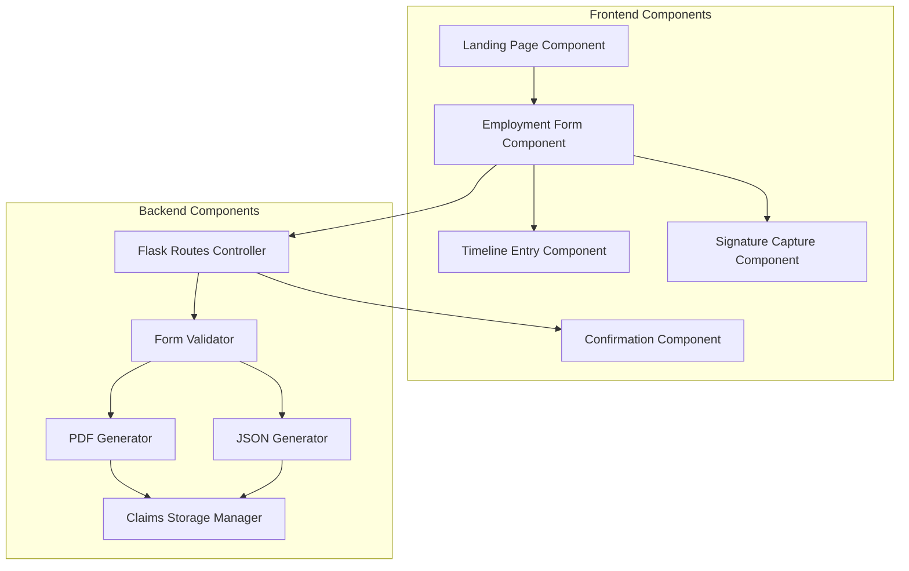

# Trua Verify Component Diagram

This document outlines the key components of the Trua Verify system and their relationships.

## Component Diagram

## Component Descriptions

### Frontend Components

#### 1. Landing Page Component
**Purpose**: Provide an entry point to the verification process.

**Responsibilities**:
- Display welcome message and explanation
- Present "Start Verification" button
- Pass tracking ID and years parameters to the form

**Implementation**:
- HTML template: `templates/index.html`
- Minimal JavaScript for button handling

#### 2. Employment Form Component
**Purpose**: Collect all required information from the candidate.

**Responsibilities**:
- Manage personal information collection
- Coordinate timeline entries
- Handle signature capture
- Validate form completeness
- Submit data to server

**Implementation**:
- HTML template: `templates/form.html`
- JavaScript: `static/js/form.js` (main form logic)
- CSS: `static/css/styles.css`

#### 3. Timeline Entry Component
**Purpose**: Manage individual employment history entries.

**Responsibilities**:
- Provide UI for different entry types (Job, Education, Unemployed, Other)
- Show/hide relevant fields based on entry type
- Calculate time coverage
- Allow adding/removing entries

**Implementation**:
- HTML template section in `templates/form.html`
- JavaScript functions in `static/js/form.js`:
  - `addTimelineEntry()`
  - `setupEntryEventListeners()`
  - `updateEntryFields()`
  - `calculateYearsAccounted()`

#### 4. Signature Capture Component
**Purpose**: Capture the candidate's digital signature.

**Responsibilities**:
- Provide canvas for signature drawing
- Convert signature to data URL
- Allow clearing and redrawing
- Validate signature presence

**Implementation**:
- HTML canvas in `templates/form.html`
- JavaScript library: `static/js/signature_pad.min.js`
- Integration in `static/js/form.js`

#### 5. Confirmation Component
**Purpose**: Confirm successful submission and provide next steps.

**Responsibilities**:
- Display success message
- Provide PDF download link
- Explain next steps to candidate

**Implementation**:
- HTML template: `templates/confirmation.html`

### Backend Components

#### 1. Flask Routes Controller
**Purpose**: Handle HTTP requests and route to appropriate handlers.

**Responsibilities**:
- Process URL parameters
- Render appropriate templates
- Handle form submission
- Manage file downloads

**Implementation**:
- Python: Route handlers in `app.py`:
  - `index()`: Redirect to verify
  - `verify()`: Landing page
  - `form()`: Employment form
  - `submit()`: Form processing
  - `download()`: PDF retrieval

#### 2. Form Validator
**Purpose**: Ensure submitted data meets requirements.

**Responsibilities**:
- Validate required fields
- Check data types and formats
- Ensure timeframe coverage

**Implementation**:
- Python: Validation logic in `submit()` function in `app.py`
- JavaScript: Client-side validation in `validateForm()` in `static/js/form.js`

#### 3. PDF Generator
**Purpose**: Create PDF documents from claim data.

**Responsibilities**:
- Format claim data for PDF
- Structure document with sections
- Embed signature image
- Generate standardized PDF file

**Implementation**:
- Python: `generate_pdf()` function in `app.py`
- Uses ReportLab library for PDF generation

#### 4. JSON Generator
**Purpose**: Create structured JSON representation of claim data.

**Responsibilities**:
- Structure claim data in consistent format
- Include all relevant fields
- Format dates appropriately

**Implementation**:
- Python: JSON creation in `submit()` function in `app.py`
- Uses Python's built-in `json` module

#### 5. Claims Storage Manager
**Purpose**: Manage persistent storage of claims.

**Responsibilities**:
- Ensure claims directory exists
- Generate unique filenames
- Store both PDF and JSON formats

**Implementation**:
- Python: File operations in `submit()` function in `app.py`
- Uses `os` module for directory and file operations

## Component Interactions

### Form Submission Flow

1. **Employment Form Component** collects and validates data
2. Data is submitted to **Flask Routes Controller** (`/submit` endpoint)
3. **Form Validator** checks data completeness and validity
4. **JSON Generator** creates structured data representation
5. **PDF Generator** creates formatted PDF document
6. **Claims Storage Manager** saves both files
7. **Flask Routes Controller** renders **Confirmation Component**

### PDF Download Flow

1. **Confirmation Component** displays download link
2. User clicks link, sending request to **Flask Routes Controller** (`/download/<filename>` endpoint)
3. **Claims Storage Manager** retrieves PDF file
4. **Flask Routes Controller** sends file to user

## Component Dependencies

| Component | Dependencies |
|-----------|--------------|
| Landing Page Component | None |
| Employment Form Component | Timeline Entry Component, Signature Capture Component |
| Timeline Entry Component | None |
| Signature Capture Component | signature_pad.min.js library |
| Confirmation Component | None |
| Flask Routes Controller | Flask framework |
| Form Validator | None |
| PDF Generator | ReportLab library |
| JSON Generator | json module |
| Claims Storage Manager | os module |

## Future Component Considerations

The current component architecture could be extended with:

1. **Authentication Component**: Manage user identity and access control
2. **Verifier Portal Component**: Provide interface for verifiers
3. **Database Manager Component**: Replace file-based storage with database operations
4. **API Gateway Component**: Provide programmatic access to the system
5. **Notification Component**: Send emails or notifications to users