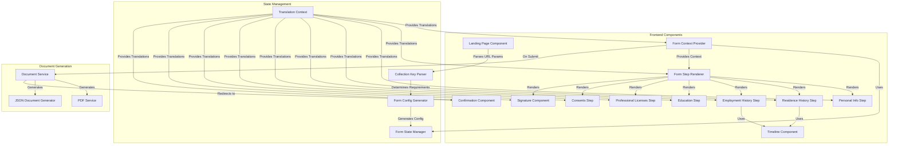

# Trua Verify Component Diagram

This document outlines the key components of the Trua Verify system and their relationships.

## Component Diagram

## Component Descriptions

### Frontend Components

#### 1. Landing Page Component
**Purpose**: Provide an entry point to the verification process.

**Responsibilities**:
- Display welcome message and explanation
- Parse URL parameters (collection key, token)
- Initialize the form with the correct configuration
- Support multiple languages based on collection key

**Implementation**:
- React component: `src/App.tsx`
- Routing: React Router

#### 2. Form Context Provider
**Purpose**: Provide centralized form state management and context.

**Responsibilities**:
- Initialize form state based on collection key
- Manage form navigation between steps
- Track form completion status
- Handle form submission
- Support dynamic initial step based on collection key

**Implementation**:
- React context: `src/context/FormContext.tsx`
- Uses FormStateManager for state management

#### 3. Form Step Renderer
**Purpose**: Render the appropriate form step based on current state.

**Responsibilities**:
- Determine which step component to render
- Pass appropriate props to step components
- Handle step transitions
- Support starting at any enabled step

**Implementation**:
- React component: `src/components/FormStepRenderer.tsx`

#### 4. Step Components
**Purpose**: Collect specific information for each verification step.

**Components**:
- **Personal Info Step**: Basic personal information
- **Residence History Step**: Address history with timeline
- **Employment History Step**: Job history with timeline
- **Education Step**: Education credentials
- **Professional Licenses Step**: License information
- **Consents Step**: Required consents

**Implementation**:
- React components in `src/components/`
- Each step has its own component, CSS, and tests

#### 5. Timeline Component
**Purpose**: Visualize and manage timeline entries.

**Responsibilities**:
- Display timeline entries chronologically
- Calculate coverage and gaps
- Validate against requirements
- Support adding, editing, and removing entries

**Implementation**:
- React component: `src/components/Timeline.tsx`
- Used by both Residence and Employment history steps

#### 6. Signature Component
**Purpose**: Capture the candidate's digital signature.

**Responsibilities**:
- Provide canvas for signature drawing
- Convert signature to data URL
- Allow clearing and redrawing
- Validate signature presence

**Implementation**:
- React component: `src/components/Signature.tsx`
- Uses signature_pad.js library

#### 7. Confirmation Component
**Purpose**: Confirm successful submission and provide next steps.

**Responsibilities**:
- Display success message
- Provide PDF download link
- Explain next steps to candidate

**Implementation**:
- React component: `src/components/ConfirmationPage.tsx`

### State Management Components

#### 1. Form State Manager
**Purpose**: Manage the form state and business logic.

**Responsibilities**:
- Maintain form state across steps
- Handle validation of steps and fields
- Control navigation between steps
- Track completion status
- Support dynamic initial step based on collection key

**Implementation**:
- TypeScript class: `src/utils/FormStateManager.ts`
- Singleton instance to prevent state resets

#### 2. Form Config Generator
**Purpose**: Generate form configuration based on requirements.

**Responsibilities**:
- Create step configuration based on collection key
- Determine which steps are enabled
- Set validation rules for each step
- Determine initial step based on collection key and isDefaultKey flag

**Implementation**:
- TypeScript utility: `src/utils/FormConfigGenerator.ts`

#### 3. Collection Key Parser
**Purpose**: Parse collection keys to determine requirements.

**Responsibilities**:
- Extract language prefix from collection key
- Parse configuration bits to determine enabled steps
- Determine required years for history steps
- Support custom and default collection keys

**Implementation**:
- TypeScript utility: `src/utils/collectionKeyParser.ts`

#### 4. Translation Context
**Purpose**: Provide internationalization support.

**Responsibilities**:
- Load translations based on language
- Provide translation functions to components
- Support language switching

**Implementation**:
- React context: `src/context/TranslationContext.tsx`

### Document Generation Components

#### 1. PDF Service
**Purpose**: Create PDF documents from form data.

**Responsibilities**:
- Format form data for PDF
- Structure document with sections
- Embed signature image
- Generate standardized PDF file

**Implementation**:
- TypeScript service: `src/services/PdfService.ts`
- Uses jsPDF library

#### 2. JSON Document Generator
**Purpose**: Create structured JSON representation of form data.

**Responsibilities**:
- Structure form data in consistent format
- Include all relevant fields
- Format dates appropriately

**Implementation**:
- TypeScript utility: `src/utils/JsonDocumentGenerator.ts`

#### 3. Document Service
**Purpose**: Coordinate document generation and handling.

**Responsibilities**:
- Generate both PDF and JSON documents
- Handle document download
- Manage document storage

**Implementation**:
- TypeScript service: `src/services/DocumentService.ts`

## Component Interactions

### Form Initialization Flow

1. **Landing Page Component** parses URL parameters (collection key, token)
2. **Collection Key Parser** extracts language and configuration bits
3. **Form Config Generator** creates form configuration based on requirements
4. **Form State Manager** initializes form state with configuration
5. **Form Context Provider** provides form state to components
6. **Form Step Renderer** renders the initial step based on collection key

### Dynamic Initial Step Flow

1. **Landing Page Component** passes collection key and isDefaultKey flag
2. **Form Config Generator** determines initial step based on collection key and isDefaultKey
3. **Form State Manager** initializes with the determined initial step
4. **Form Context Provider** tracks currentContextStep separately from form state
5. **Form Step Renderer** renders the appropriate step component
6. **Step Components** initialize with the current step's data

### Form Navigation Flow

1. **Step Components** validate input and update form state
2. **Form State Manager** tracks completion status of each step
3. **Form Context Provider** provides navigation methods (moveToNextStep, moveToPreviousStep)
4. **Form Step Renderer** updates to show the new current step
5. **Form State Manager** ensures proper state synchronization during navigation

### Form Submission Flow

1. **Form Context Provider** collects and validates all form data
2. **Document Service** coordinates document generation
3. **JSON Document Generator** creates structured data representation
4. **PDF Service** creates formatted PDF document
5. **Form Context Provider** redirects to **Confirmation Component**

## Component Dependencies

| Component | Dependencies |
|-----------|--------------|
| Landing Page Component | React Router |
| Form Context Provider | FormStateManager, FormConfigGenerator |
| Form Step Renderer | FormContext |
| Step Components | FormContext, Timeline Component (for history steps) |
| Timeline Component | None |
| Signature Component | signature_pad.js library |
| Confirmation Component | None |
| Form State Manager | None |
| Form Config Generator | Collection Key Parser |
| Collection Key Parser | None |
| Translation Context | i18next library |
| PDF Service | jsPDF library |
| JSON Document Generator | None |
| Document Service | PDF Service, JSON Document Generator |

## Future Component Considerations

The current component architecture could be extended with:

1. **Authentication Component**: Manage user identity and access control
2. **Verifier Portal Component**: Provide interface for verifiers
3. **Database Manager Component**: Replace file-based storage with database operations
4. **API Gateway Component**: Provide programmatic access to the system
5. **Notification Component**: Send emails or notifications to users
6. **Form State Persistence Component**: Save and restore form state for resuming later
7. **Dynamic Step Component**: Support conditional steps based on previous answers
8. **Testing Mode Component**: Enhanced support for testing specific form sections
9. **Analytics Component**: Track form usage and completion metrics