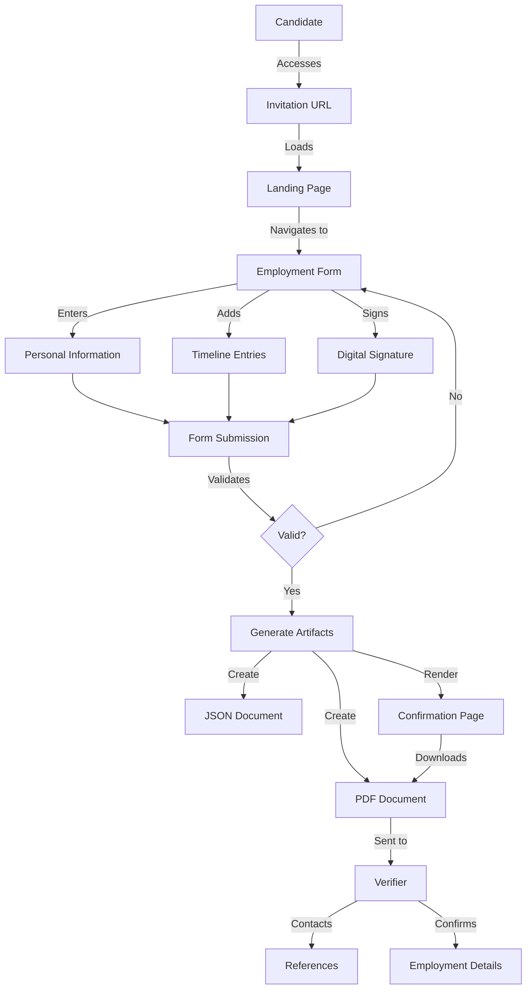

# Trua Verify Data Flow Diagram

This document illustrates how data flows through the Trua Verify system, from initial access to final verification.

## Main Data Flow



## Data Elements and Transformations

### 1. Initial Data Input

- **Invitation URL Parameters**:
  - `tracking_id`: Unique identifier for the verification request
  - `years`: Required timeframe to account for (e.g., 7 years)

### 2. Form Data Collection

- **Personal Information**:
  - Full Name (required)
  - Email (required)
  - Phone (optional)

- **Timeline Entries** (multiple):
  - Entry Type (Job, Education, Unemployed, Other)
  - Company/Organization (required for Job/Education)
  - Position/Title (required for Job/Education)
  - Start Date (required)
  - End Date (required unless current)
  - Is Current Flag (boolean)
  - Description (optional)
  - Contact Information (required for Job):
    - Contact Name
    - Contact Email/Phone

- **Digital Signature**:
  - Canvas-based signature capture
  - Converted to Base64-encoded PNG image

### 3. Data Validation

- **Client-side Validation**:
  - Required field checks
  - Date consistency (start before end)
  - Timeframe coverage calculation
  - Signature presence check

- **Server-side Validation**:
  - Form data completeness
  - Data type verification

### 4. Data Transformation

- **JSON Document Creation**:
  - Structured representation of all form data
  - Includes metadata (submission date, tracking ID)
  - Stored as `truaverify_<tracking_id>_<date>.json`

- **PDF Document Creation**:
  - Formatted presentation of form data
  - Embedded signature image
  - Attestation statement
  - Stored as `truaverify_<tracking_id>_<date>.pdf`

### 5. Data Output

- **Confirmation Page Data**:
  - Success message
  - Claimant name
  - PDF download link

- **PDF Download**:
  - Complete claim document for candidate and verifier

## Data Storage

All data is stored in the `claims/` directory with the following structure:

```
claims/
  ├── truaverify_abc123_20250317.json  # JSON data file
  └── truaverify_abc123_20250317.pdf   # PDF document
```

## External Data Flow

The system does not directly interact with external systems. The PDF document is manually shared with the verifier, who then uses the contact information to verify employment details outside the system.

## Data Security Considerations

1. **Data in Transit**: The current implementation does not specify HTTPS, which should be implemented for production.

2. **Data at Rest**: Files are stored without encryption in the claims directory.

3. **Data Access Control**: No authentication mechanism exists to restrict access to stored claims.

4. **Data Retention**: No automatic data retention or deletion policy is implemented.

These security considerations should be addressed in future enhancements to the system.