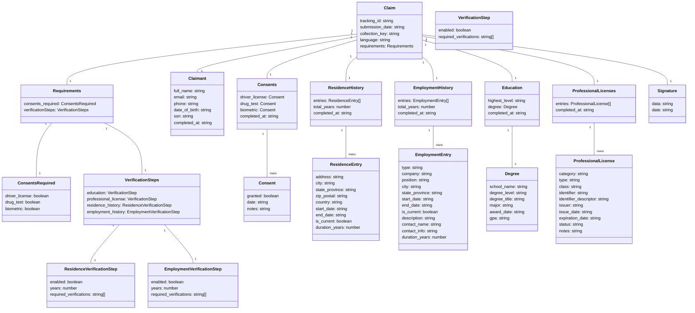

# Trua Verify Data Model

This document describes the data structures used in the Trua Verify system, their relationships, and how they map to the system's functionality.

## Data Model Diagram



## Data Structures

### Claim

The `Claim` is the central data structure that represents a complete verification submission.

**Attributes**:
- `tracking_id`: string - Unique identifier for the verification request, provided in the invitation URL
- `submission_date`: string - When the claim was submitted, automatically generated (ISO format)
- `collection_key`: string - Unique key for the collection session (e.g., "en101110101100")
- `language`: string - Language code for the submission (e.g., "en")
- `requirements`: Requirements - Configuration for required verifications and consents

**Relationships**:
- Has one `Claimant` (the person submitting the claim)
- Has one `Requirements` (configuration for the verification process)
- Has one `Consents` (collection of consent records)
- Has one `ResidenceHistory` (collection of residence entries)
- Has one `EmploymentHistory` (collection of employment entries)
- Has one `Education` (education verification information)
- Has one `ProfessionalLicenses` (collection of professional license entries)
- Has one `Signature` (digital signature information)

**Storage**:
- Stored as JSON in `claims/truaverify_<tracking_id>_<date>.json`
- Also represented in PDF format in `claims/truaverify_<tracking_id>_<date>.pdf`

### Requirements

The `Requirements` structure defines what verifications and consents are required for this claim.

**Attributes**:
- `consents_required`: ConsentsRequired - Which consent types are required
- `verificationSteps`: VerificationSteps - Configuration for verification steps

### ConsentsRequired

The `ConsentsRequired` structure defines which consent types are required.

**Attributes**:
- `driver_license`: boolean - Whether driver's license consent is required
- `drug_test`: boolean - Whether drug test consent is required
- `biometric`: boolean - Whether biometric consent is required

### VerificationSteps

The `VerificationSteps` structure defines the configuration for verification steps.

**Attributes**:
- `education`: VerificationStep - Configuration for education verification
- `professional_license`: VerificationStep - Configuration for professional license verification
- `residence_history`: ResidenceVerificationStep - Configuration for residence history verification
- `employment_history`: EmploymentVerificationStep - Configuration for employment history verification

### VerificationStep

The `VerificationStep` structure defines the configuration for a verification step.

**Attributes**:
- `enabled`: boolean - Whether this verification step is enabled
- `required_verifications`: string[] - List of required verification types

### ResidenceVerificationStep

The `ResidenceVerificationStep` structure extends VerificationStep with residence-specific configuration.

**Attributes**:
- `enabled`: boolean - Whether residence verification is enabled
- `years`: number - Number of years of residence history required
- `required_verifications`: string[] - List of required verification types

### EmploymentVerificationStep

The `EmploymentVerificationStep` structure extends VerificationStep with employment-specific configuration.

**Attributes**:
- `enabled`: boolean - Whether employment verification is enabled
- `years`: number - Number of years of employment history required
- `required_verifications`: string[] - List of required verification types

### Claimant

The `Claimant` represents the individual submitting the verification claim.

**Attributes**:
- `full_name`: string - The candidate's full name
- `email`: string - The candidate's email address
- `phone`: string - The candidate's phone number
- `date_of_birth`: string - The candidate's date of birth (ISO format)
- `ssn`: string - The candidate's Social Security Number
- `completed_at`: string - When this section was completed (ISO format)

**Relationships**:
- Belongs to one `Claim`

**Storage**:
- Nested within the `Claim` JSON structure
- Displayed prominently in the PDF document

### Consents

The `Consents` structure represents the collection of consent records.

**Attributes**:
- `driver_license`: Consent - Driver's license consent record
- `drug_test`: Consent - Drug test consent record
- `biometric`: Consent - Biometric consent record
- `completed_at`: string - When this section was completed (ISO format)

**Relationships**:
- Belongs to one `Claim`
- Has many `Consent` objects

**Storage**:
- Nested within the `Claim` JSON structure
- Displayed in the PDF document

### Consent

The `Consent` structure represents a single consent record.

**Attributes**:
- `granted`: boolean - Whether consent was granted
- `date`: string - When consent was granted (ISO format)
- `notes`: string - Additional notes about the consent

**Relationships**:
- Belongs to one `Consents` collection

**Storage**:
- Nested within the `Consents` structure in the JSON
- Displayed in the PDF document

### ResidenceHistory

The `ResidenceHistory` structure represents the collection of residence entries.

**Attributes**:
- `entries`: ResidenceEntry[] - Array of residence entries
- `total_years`: number - Total years covered by residence entries
- `completed_at`: string - When this section was completed (ISO format)

**Relationships**:
- Belongs to one `Claim`
- Has many `ResidenceEntry` objects

**Storage**:
- Nested within the `Claim` JSON structure
- Displayed in the PDF document

### ResidenceEntry

A `ResidenceEntry` represents a single address in the candidate's residence history.

**Attributes**:
- `address`: string - Street address
- `city`: string - City
- `state_province`: string - State, province, or region
- `zip_postal`: string - ZIP or postal code
- `country`: string - Country
- `start_date`: string - When the candidate began residing at this address (ISO format)
- `end_date`: string | null - When the candidate stopped residing at this address (null if current)
- `is_current`: boolean - Whether this is the current residence
- `duration_years`: number - Duration of residence in years

**Relationships**:
- Belongs to one `ResidenceHistory` collection

**Storage**:
- Stored as an array within the `ResidenceHistory` structure
- Displayed as separate sections in the PDF document

### EmploymentHistory

The `EmploymentHistory` structure represents the collection of employment entries.

**Attributes**:
- `entries`: EmploymentEntry[] - Array of employment entries
- `total_years`: number - Total years covered by employment entries
- `completed_at`: string - When this section was completed (ISO format)

**Relationships**:
- Belongs to one `Claim`
- Has many `EmploymentEntry` objects

**Storage**:
- Nested within the `Claim` JSON structure
- Displayed in the PDF document

### EmploymentEntry

An `EmploymentEntry` represents a single period in the candidate's employment history.

**Attributes**:
- `type`: string - Type of entry (Job, Education, Unemployed, Other)
- `company`: string - Company or organization name
- `position`: string - Position or title
- `city`: string - City
- `state_province`: string - State, province, or region
- `start_date`: string - When the period began (ISO format)
- `end_date`: string | null - When the period ended (null if current)
- `is_current`: boolean - Whether this is the current position
- `description`: string - Additional details about the period
- `contact_name`: string - Name of reference contact
- `contact_info`: string - Email or phone of reference contact
- `duration_years`: number - Duration of employment in years

**Relationships**:
- Belongs to one `EmploymentHistory` collection

**Storage**:
- Stored as an array within the `EmploymentHistory` structure
- Displayed as separate sections in the PDF document

### Education

The `Education` structure represents the candidate's education information.

**Attributes**:
- `highest_level`: string - Highest level of education achieved
- `degree`: Degree - Degree information
- `completed_at`: string - When this section was completed (ISO format)

**Relationships**:
- Belongs to one `Claim`
- Has one `Degree`

**Storage**:
- Nested within the `Claim` JSON structure
- Displayed in the PDF document

### Degree

The `Degree` structure represents detailed information about a degree.

**Attributes**:
- `school_name`: string - Name of the educational institution
- `degree_level`: string - Level of the degree (e.g., "Bachelor's")
- `degree_title`: string - Title of the degree (e.g., "Bachelor of Science")
- `major`: string - Field of study
- `award_date`: string - When the degree was awarded (ISO format)
- `gpa`: string - Grade Point Average

**Relationships**:
- Belongs to one `Education` structure

**Storage**:
- Nested within the `Education` structure in the JSON
- Displayed in the PDF document

### ProfessionalLicenses

The `ProfessionalLicenses` structure represents the collection of professional license entries.

**Attributes**:
- `entries`: ProfessionalLicense[] - Array of professional license entries
- `completed_at`: string - When this section was completed (ISO format)

**Relationships**:
- Belongs to one `Claim`
- Has many `ProfessionalLicense` objects

**Storage**:
- Nested within the `Claim` JSON structure
- Displayed in the PDF document

### ProfessionalLicense

A `ProfessionalLicense` represents a single professional license or certification.

**Attributes**:
- `category`: string - Category of the license
- `type`: string - Type of the license
- `class`: string - Class or level of the license
- `identifier`: string - License identifier or number
- `identifier_descriptor`: string - Description of the identifier
- `issuer`: string - Organization that issued the license
- `issue_date`: string - When the license was issued (ISO format)
- `expiration_date`: string - When the license expires (ISO format)
- `status`: string - Current status of the license
- `notes`: string - Additional notes about the license

**Relationships**:
- Belongs to one `ProfessionalLicenses` collection

**Storage**:
- Stored as an array within the `ProfessionalLicenses` structure
- Displayed as separate sections in the PDF document

### Signature

The `Signature` structure represents the candidate's digital signature.

**Attributes**:
- `data`: string - Base64-encoded PNG image of the signature
- `date`: string - When the signature was created (ISO format)

**Relationships**:
- Belongs to one `Claim`

**Storage**:
- Nested within the `Claim` JSON structure
- Displayed in the PDF document

## Collection Key Concept

The Collection Key is a 14-character hybrid string that drives the dynamic behavior of the form. For example: `en101110101100`

### Key Structure

1. **Language Prefix** (2 characters)
   - Sets the UI language (e.g., "en" for English, "es" for Spanish)
   - Examples: "en", "es", "fr", "it"

2. **Configuration Bits** (12 bits)
   - Bit 0: Personal Information (always 1)
   - Bits 1-3: Consents
     - Bit 1: Driver's License Consent (0=not required, 1=required)
     - Bit 2: Drug Test Consent (0=not required, 1=required)
     - Bit 3: Biometric Consent (0=not required, 1=required)
   - Bits 4-9: Steps
     - Bit 4: Education (0=not required, 1=required)
     - Bit 5: Professional Licenses (0=not required, 1=required)
     - Bit 6: Residence History (0=not required, 1=required)
     - Bits 7-9: Residence Timeline Years (000=1yr, 011=3yrs, 101=5yrs, 111=7yrs, 101=10yrs)
   - Bits 10-13: Employment Timeline
     - Bit 10: Employment History (0=not required, 1=required)
     - Bits 11-13: Employment Timeline Years (000=1yr, 011=3yrs, 101=5yrs, 111=7yrs, 101=10yrs)

### Example Collection Keys

1. **en100000000000**: English, Personal Information only
2. **en110000000000**: English, Personal Information + Driver's License Consent
3. **en111000000000**: English, Personal Information + All Consents
4. **en100100000000**: English, Personal Information + Education
5. **en100010000000**: English, Personal Information + Professional Licenses
6. **en100001101000**: English, Personal Information + Residence History (5 years)
7. **en100000001111**: English, Personal Information + Employment History (7 years)
8. **en111111101111**: English, All Steps Enabled (Full Collection)
9. **es111111101111**: Spanish, All Steps Enabled (Full Collection)

### TypeScript Implementation

```typescript
// Collection Key Types
interface CollectionKey {
  language: string;
  bits: string;
}

// Parse Collection Key
function parseCollectionKey(key: string): CollectionKey {
  return {
    language: key.substring(0, 2),
    bits: key.substring(2)
  };
}

// Check if a specific bit is enabled
function isBitEnabled(bits: string, position: number): boolean {
  return bits.charAt(position) === '1';
}

// Get timeline years from bits
function getTimelineYears(bits: string, startPosition: number): number {
  const timelineBits = bits.substring(startPosition, startPosition + 3);
  switch (timelineBits) {
    case '000': return 1;
    case '011': return 3;
    case '101': return 5;
    case '111': return 7;
    case '101': return 10;
    default: return 1;
  }
}

// Get form requirements from collection key
function getRequirements(collectionKey: string): Requirements {
  const { language, bits } = parseCollectionKey(collectionKey);
  
  return {
    language,
    consents_required: {
      driver_license: isBitEnabled(bits, 1),
      drug_test: isBitEnabled(bits, 2),
      biometric: isBitEnabled(bits, 3)
    },
    verificationSteps: {
      education: {
        enabled: isBitEnabled(bits, 4),
        required_verifications: ["degree", "institution", "graduation_date"]
      },
      professional_license: {
        enabled: isBitEnabled(bits, 5),
        required_verifications: ["status", "expiration_date"]
      },
      residence_history: {
        enabled: isBitEnabled(bits, 6),
        years: getTimelineYears(bits, 7),
        required_verifications: ["address", "duration"]
      },
      employment_history: {
        enabled: isBitEnabled(bits, 10),
        years: getTimelineYears(bits, 11),
        required_verifications: ["employment", "duration", "position"]
      }
    }
  };
}
```

## TypeScript Interfaces

```typescript
interface Claim {
  tracking_id: string;
  submission_date: string;
  collection_key: string;
  language: string;
  requirements: Requirements;
  claimant: Claimant;
  consents: Consents;
  residence_history: ResidenceHistory;
  employment_history: EmploymentHistory;
  education: Education;
  professional_licenses: ProfessionalLicenses;
  signature: Signature;
}

interface Requirements {
  consents_required: {
    driver_license: boolean;
    drug_test: boolean;
    biometric: boolean;
  };
  verificationSteps: {
    education: {
      enabled: boolean;
      required_verifications: string[];
    };
    professional_license: {
      enabled: boolean;
      required_verifications: string[];
    };
    residence_history: {
      enabled: boolean;
      years: number;
      required_verifications: string[];
    };
    employment_history: {
      enabled: boolean;
      years: number;
      required_verifications: string[];
    };
  };
}

interface Claimant {
  full_name: string;
  email: string;
  phone: string;
  date_of_birth: string;
  ssn: string;
  completed_at: string;
}

interface Consent {
  granted: boolean;
  date?: string;
  notes?: string;
}

interface Consents {
  driver_license: Consent;
  drug_test: Consent;
  biometric: Consent;
  completed_at: string;
}

interface ResidenceEntry {
  address: string;
  city: string;
  state_province: string;
  zip_postal: string;
  country: string;
  start_date: string;
  end_date: string | null;
  is_current: boolean;
  duration_years: number;
}

interface ResidenceHistory {
  entries: ResidenceEntry[];
  total_years: number;
  completed_at: string;
}

interface EmploymentEntry {
  type: string;
  company: string;
  position: string;
  city: string;
  state_province: string;
  start_date: string;
  end_date: string | null;
  is_current: boolean;
  description: string;
  contact_name: string;
  contact_info: string;
  duration_years: number;
}

interface EmploymentHistory {
  entries: EmploymentEntry[];
  total_years: number;
  completed_at: string;
}

interface Degree {
  school_name: string;
  degree_level: string;
  degree_title: string;
  major: string;
  award_date: string;
  gpa: string;
}

interface Education {
  highest_level: string;
  degree: Degree;
  completed_at: string;
}

interface ProfessionalLicense {
  category: string;
  type: string;
  class: string;
  identifier: string;
  identifier_descriptor: string;
  issuer: string;
  issue_date: string;
  expiration_date: string;
  status: string;
  notes: string;
}

interface ProfessionalLicenses {
  entries: ProfessionalLicense[];
  completed_at: string;
}

interface Signature {
  data: string;
  date: string;
}
```

## JSON Structure Example

```json
{
  "tracking_id": "abc123",
  "submission_date": "2025-03-19",
  "collection_key": "en101110101100",
  "language": "en",
  "requirements": {
    "consents_required": {
      "driver_license": true,
      "drug_test": false,
      "biometric": true
    },
    "verificationSteps": {
      "education": {
        "enabled": true,
        "required_verifications": ["degree", "institution", "graduation_date"]
      },
      "professional_license": {
        "enabled": true,
        "required_verifications": ["status", "expiration_date"]
      },
      "residence_history": {
        "enabled": true,
        "years": 5,
        "required_verifications": ["address", "duration"]
      },
      "employment_history": {
        "enabled": true,
        "years": 10,
        "required_verifications": ["employment", "duration", "position"]
      }
    }
  },
  "claimant": {
    "full_name": "John Michael Smith",
    "email": "john.smith@example.com",
    "phone": "555-987-6543",
    "date_of_birth": "1995-04-12",
    "ssn": "123-45-6789",
    "completed_at": "2025-03-19T10:15:00Z"
  },
  "consents": {
    "driver_license": {
      "granted": true,
      "date": "2025-03-19T10:16:00Z",
      "notes": "Consent for DMV record check"
    },
    "drug_test": {
      "granted": false
    },
    "biometric": {
      "granted": true,
      "date": "2025-03-19T10:16:30Z",
      "notes": "Fingerprint authorization"
    },
    "completed_at": "2025-03-19T10:17:00Z"
  },
  "residence_history": {
    "entries": [
      {
        "address": "123 Main St",
        "city": "Springfield",
        "state_province": "IL",
        "zip_postal": "62701",
        "country": "United States",
        "start_date": "2023-06-01",
        "end_date": null,
        "is_current": true,
        "duration_years": 1.75
      },
      {
        "address": "456 Oak Ave",
        "city": "Chicago",
        "state_province": "IL",
        "zip_postal": "60601",
        "country": "United States",
        "start_date": "2020-06-01",
        "end_date": "2023-05-31",
        "is_current": false,
        "duration_years": 3.0
      },
      {
        "address": "789 Pine Rd",
        "city": "Naperville",
        "state_province": "IL",
        "zip_postal": "60540",
        "country": "United States",
        "start_date": "2018-01-01",
        "end_date": "2020-05-31",
        "is_current": false,
        "duration_years": 2.5
      }
    ],
    "total_years": 7.25,
    "completed_at": "2025-03-19T10:20:00Z"
  },
  "employment_history": {
    "entries": [
      {
        "type": "Job",
        "company": "Nexlify",
        "position": "Product Manager",
        "city": "Springfield",
        "state_province": "IL",
        "start_date": "2020-06-01",
        "end_date": "2023-05-31",
        "is_current": false,
        "description": "Managed product development lifecycle",
        "contact_name": "Jane Doe (Supervisor, Senior Engineering Manager)",
        "contact_info": "555-123-4567, jane.doe@nexlify.com",
        "duration_years": 3.0
      },
      {
        "type": "Job",
        "company": "Freelance",
        "position": "Consultant",
        "city": "Chicago",
        "state_province": "IL",
        "start_date": "2019-01-01",
        "end_date": "2020-05-31",
        "is_current": false,
        "description": "Provided strategic consulting services",
        "contact_name": "John Smith (Client, Project Lead)",
        "contact_info": "john.smith@clientco.com",
        "duration_years": 1.5
      },
      {
        "type": "Unemployed",
        "company": "",
        "position": "",
        "city": "",
        "state_province": "",
        "start_date": "2018-03-01",
        "end_date": "2018-12-31",
        "is_current": false,
        "description": "Sabbatical and job search",
        "contact_name": "",
        "contact_info": "",
        "duration_years": 0.75
      },
      {
        "type": "Job",
        "company": "TechCorp",
        "position": "Junior Developer",
        "city": "Naperville",
        "state_province": "IL",
        "start_date": "2015-03-01",
        "end_date": "2018-02-28",
        "is_current": false,
        "description": "Developed web applications",
        "contact_name": "Mike Johnson (Team Lead)",
        "contact_info": "mike.johnson@techcorp.com",
        "duration_years": 3.0
      }
    ],
    "total_years": 10.25,
    "completed_at": "2025-03-19T10:25:00Z"
  },
  "education": {
    "highest_level": "Bachelor's",
    "degree": {
      "school_name": "University of Illinois",
      "degree_level": "Bachelor's",
      "degree_title": "Bachelor of Science",
      "major": "Computer Science",
      "award_date": "2018-05-15",
      "gpa": "3.8"
    },
    "completed_at": "2025-03-19T10:18:00Z"
  },
  "professional_licenses": {
    "entries": [
      {
        "category": "Project Management",
        "type": "Certified ScrumMaster",
        "class": "CSM",
        "identifier": "CSM-987654",
        "identifier_descriptor": "Scrum Alliance Certification Number",
        "issuer": "Scrum Alliance",
        "issue_date": "2020-01-15",
        "expiration_date": "2026-01-14",
        "status": "active",
        "notes": "Used in product management role"
      },
      {
        "category": "Project Management",
        "type": "Project Management Professional",
        "class": "PMP",
        "identifier": "PMP-123456",
        "identifier_descriptor": "PMI Certification ID",
        "issuer": "Project Management Institute (PMI)",
        "issue_date": "2019-03-10",
        "expiration_date": "2025-03-09",
        "status": "active",
        "notes": "Maintained through annual PDU requirements"
      }
    ],
    "completed_at": "2025-03-19T10:19:00Z"
  },
  "signature": {
    "data": "data:image/png;base64,iVBORw0KGgoAAAANSUhEUgAA...",
    "date": "2025-03-19T10:30:00Z"
  }
}
```

## Data Validation Rules

### Claim Validation
- `tracking_id` must be present
- `collection_key` must be present and follow the format: 2-character language code + 12 bits
- `language` must be a valid language code

### Claimant Validation
- `full_name` must be present
- `email` must be present and a valid email format
- `date_of_birth` must be a valid date
- `ssn` must be a valid SSN format

### Consents Validation
- Required consents (as specified in `requirements.consents_required`) must be granted

### ResidenceHistory Validation
- `entries` must contain at least one entry
- Total years covered must meet or exceed the required years (from `requirements.verificationSteps.residence_history.years`)
- Each entry must pass ResidenceEntry validation

### ResidenceEntry Validation
- `address` must be present
- `city` must be present
- `state_province` must be present
- `zip_postal` must be present
- `country` must be present
- `start_date` must be present and a valid date
- `end_date` must be present and a valid date, unless `is_current` is true
- `start_date` must be before `end_date` if both are present
- Residence entries should not have overlapping dates

### EmploymentHistory Validation
- `entries` must contain at least one entry
- Total years covered must meet or exceed the required years (from `requirements.verificationSteps.employment_history.years`)
- Each entry must pass EmploymentEntry validation

### EmploymentEntry Validation
- `type` must be one of: "Job", "Education", "Unemployed", "Other"
- `company` is required if `type` is "Job"
- `position` is required if `type` is "Job"
- `start_date` must be present and a valid date
- `end_date` must be present and a valid date, unless `is_current` is true
- `start_date` must be before `end_date` if both are present
- `contact_name` is required if `type` is "Job"
- `contact_info` is required if `type` is "Job"

### Education Validation
- If education verification is enabled, `degree` must be present and valid
- `school_name` must be present
- `degree_level` must be present
- `degree_title` must be present
- `major` must be present
- `award_date` must be a valid date

### ProfessionalLicense Validation
- If professional license verification is enabled, at least one license entry must be present
- `type` must be present
- `identifier` must be present
- `issuer` must be present
- `issue_date` must be a valid date
- `expiration_date` must be a valid date
- `status` must be present

### Signature Validation
- `data` must be present and a valid Base64-encoded image
- `date` must be a valid date

## Data Flow

1. **Data Collection**:
   - Form fields map directly to data structure attributes
   - Client-side validation ensures data integrity
   - Each section has its own completion timestamp

2. **Data Processing**:
   - Server parses form data into structured objects
   - Timeline entries are processed from indexed form fields
   - Residence entries are processed from indexed form fields
   - Education and professional license data is processed

3. **Data Storage**:
   - Complete data structure is serialized to JSON
   - Same data is formatted into PDF

4. **Data Retrieval**:
   - PDF is provided to candidate for download
   - JSON is available for programmatic access

## Data Security Considerations

The current implementation has the following data security characteristics:

1. **Data Exposure**:
   - Personal information (name, email, phone, SSN, DOB) is stored in plain text
   - Employment history details are stored in plain text
   - Residence history details are stored in plain text
   - Signature is stored as Base64-encoded image

2. **Access Control**:
   - No authentication mechanism for accessing stored claims
   - Files are accessible via direct URL if filename is known

3. **Data Integrity**:
   - No digital signatures or checksums to verify document authenticity
   - No versioning to track changes to claims

## Future Data Model Enhancements

The data model could be extended to include:

1. **User Accounts**:
   - Add authentication and authorization models
   - Associate claims with user accounts

2. **Verification Status**:
   - Add status tracking for the verification process
   - Include verification results and notes

3. **Audit Trail**:
   - Track all interactions with the claim
   - Record timestamps and actions

4. **Document Versioning**:
   - Support multiple versions of a claim
   - Track changes between versions

5. **Address Verification**:
   - Add verification status for each residence entry
   - Include verification method and results