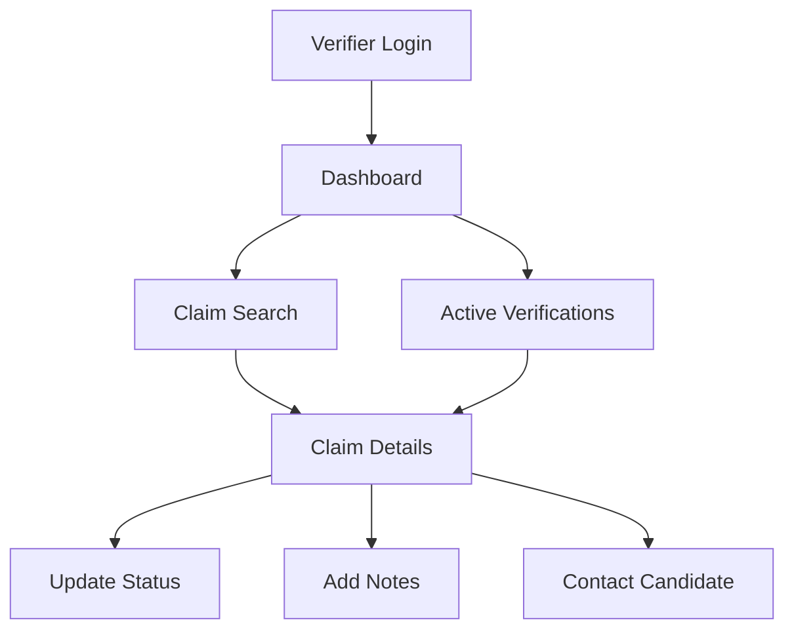

# Trua Verify Implementation Recommendations

Based on the analysis of the current Trua Verify implementation and its alignment with the requirements, this document outlines recommendations for improvements and enhancements.

## Current Implementation Strengths

Before discussing improvements, it's important to acknowledge the strengths of the current implementation:

1. **Complete Core Functionality**: The system successfully implements the primary use case of submitting employment history claims with digital signatures.

2. **Robust Validation**: The implementation includes comprehensive client-side validation to ensure data completeness and timeframe coverage.

3. **Flexible Timeline Entries**: The system supports various entry types (Job, Education, Unemployed, Other) with appropriate field requirements.

4. **Professional Document Generation**: The PDF generation creates well-structured, professional documents suitable for verification.

5. **Dual-Format Storage**: Both JSON and PDF formats provide flexibility for different usage scenarios.

## Recommended Improvements

### 1. Security Enhancements

**Current Limitations**:
- No authentication mechanism
- Plain text storage of personal information
- No encryption for stored claims
- Limited input sanitization

**Current Security Features**:
- CSRF protection is already implemented using Flask-WTF

**Recommendations**:
- Implement HTTPS for all communications (High Priority)
- Add authentication for accessing claims (High Priority)
- Encrypt sensitive data at rest (Medium Priority)
- Add rate limiting for submission attempts (Medium Priority)
- Implement proper input sanitization (High Priority)

**Implementation Approach**:
```python
# Example: Adding encryption for sensitive data
from cryptography.fernet import Fernet

# Generate a key and store it securely
key = Fernet.generate_key()

# Create a cipher suite
cipher_suite = Fernet(key)

# Encrypt sensitive data
def encrypt_data(data):
    return cipher_suite.encrypt(data.encode()).decode()

# Decrypt data when needed
def decrypt_data(encrypted_data):
    return cipher_suite.decrypt(encrypted_data.encode()).decode()
```

### 2. Verifier Interface

**Current Limitations**:
- No dedicated interface for verifiers
- Manual PDF sharing process
- No verification status tracking

**Recommendations**:
- Create a verifier portal with secure access
- Implement claim search by tracking ID
- Add verification status tracking (Pending, In Progress, Verified, Rejected)
- Enable direct communication between verifiers and candidates
- Add verification notes and results recording

**Implementation Approach**:


### 3. Database Integration

**Current Limitations**:
- File-based storage limits scalability
- No indexing or efficient querying
- Limited data relationships

**Recommendations**:
- Replace file-based storage with a relational database
- Create proper data models with relationships
- Implement efficient querying and filtering
- Add metadata for better organization

**Implementation Approach**:
```python
# Example: SQLAlchemy models
from flask_sqlalchemy import SQLAlchemy

db = SQLAlchemy(app)

class Claim(db.Model):
    id = db.Column(db.Integer, primary_key=True)
    tracking_id = db.Column(db.String(50), unique=True, nullable=False)
    submission_date = db.Column(db.DateTime, nullable=False)
    years_requested = db.Column(db.Float, nullable=False)
    claimant_id = db.Column(db.Integer, db.ForeignKey('claimant.id'))
    claimant = db.relationship('Claimant', backref='claim', uselist=False)
    timeline_entries = db.relationship('TimelineEntry', backref='claim')
    signature = db.Column(db.Text, nullable=False)
    
# Additional models for Claimant and TimelineEntry
```

### 4. Audit Trail and Versioning

**Current Limitations**:
- No history of changes or interactions
- No support for claim updates or corrections
- Limited accountability

**Recommendations**:
- Implement comprehensive logging of all system interactions
- Add support for claim versions and updates
- Track all access to claims
- Record verification activities

**Implementation Approach**:
```python
# Example: Activity logging
class ActivityLog(db.Model):
    id = db.Column(db.Integer, primary_key=True)
    timestamp = db.Column(db.DateTime, default=datetime.utcnow)
    user_id = db.Column(db.Integer, db.ForeignKey('user.id'))
    claim_id = db.Column(db.Integer, db.ForeignKey('claim.id'))
    action = db.Column(db.String(50), nullable=False)
    details = db.Column(db.Text)
    ip_address = db.Column(db.String(50))
```

### 5. API Integration

**Current Limitations**:
- No programmatic access to the system
- Limited integration capabilities
- Manual processes for data exchange

**Recommendations**:
- Create a RESTful API for system integration
- Implement secure API authentication
- Support webhook notifications for events
- Enable bulk operations for efficiency

**Implementation Approach**:
```python
# Example: API endpoint for claim retrieval
@app.route('/api/claims/<tracking_id>', methods=['GET'])
@api_auth_required
def get_claim(tracking_id):
    claim = Claim.query.filter_by(tracking_id=tracking_id).first_or_404()
    return jsonify(claim.to_dict())
```

### 6. User Experience Enhancements

**Current Limitations**:
- No ability to save progress and return later
- Limited guidance during form completion
- No mobile-specific optimizations

**Recommendations**:
- Implement draft saving functionality
- Add step-by-step guided form completion
- Enhance mobile responsiveness
- Provide better feedback and help text
- Add progress indicators

**Implementation Approach**:
```javascript
// Example: Draft saving functionality
function saveDraft() {
    const formData = collectFormData();
    localStorage.setItem('truaverify_draft_' + tracking_id, JSON.stringify(formData));
    showNotification('Draft saved successfully');
}

// Auto-save every 2 minutes
setInterval(saveDraft, 120000);
```

### 7. Accessibility Improvements

**Current Limitations**:
- Limited accessibility considerations
- No alternative to canvas-based signature

**Recommendations**:
- Implement WCAG 2.1 AA compliance
- Add keyboard navigation support
- Provide alternative signature methods
- Improve screen reader compatibility
- Add high-contrast mode

**Implementation Approach**:
```html
<!-- Example: Alternative signature method -->
<div class="signature-alternatives">
    <button type="button" id="type-signature">Type Your Signature Instead</button>
    <div id="typed-signature-container" style="display: none;">
        <label for="typed-signature">Type your full legal name:</label>
        <input type="text" id="typed-signature" class="signature-input">
        <p>By typing my name, I understand this constitutes a legal signature.</p>
    </div>
</div>
```

## Implementation Prioritization

The following table provides a suggested prioritization for implementing these recommendations:

| Recommendation | Priority | Complexity | Impact | Implementation Status |
|----------------|----------|------------|--------|----------------------|
| Security Enhancements - CSRF Protection | High | Low | High | ✅ Implemented |
| Security Enhancements - HTTPS | High | Low | High | ⏳ Planned |
| Security Enhancements - Authentication | High | Medium | High | ⏳ Planned |
| Security Enhancements - Encryption | Medium | Medium | High | ⏳ Planned |
| Database Integration | High | High | High | ⏳ Planned |
| Verifier Interface | High | Medium | High | ⏳ Planned |
| Audit Trail and Versioning | Medium | Medium | Medium | ⏳ Planned |
| User Experience Enhancements | Medium | Low | Medium | ⏳ Planned |
| API Integration | Low | Medium | Medium | ⏳ Planned |
| Accessibility Improvements | Medium | Low | High | ⏳ Planned |

## Phased Implementation Plan

### Current Status
- Core functionality implemented
- CSRF protection implemented
- File-based storage functioning
- Client-side and server-side validation in place
- PDF and JSON generation working

### Phase 1: Critical Security & Storage Improvements
- Implement HTTPS for all communications
- Add authentication for accessing claims
- Migrate to database storage
- Implement proper input sanitization
- Add basic audit logging

### Phase 2: Verifier Experience
- Create verifier portal
- Implement verification status tracking
- Add communication capabilities
- Encrypt sensitive data at rest

### Phase 3: User Experience
- Implement draft saving
- Enhance mobile experience
- Improve accessibility
- Add rate limiting for submission attempts

### Phase 4: Integration and Extension
- Develop API for system integration
- Implement webhooks
- Add advanced reporting
- Support for internationalization

## Conclusion

The current Trua Verify implementation provides a solid foundation for employment history verification with all core functionality successfully implemented. The system effectively handles the submission of employment history claims, digital signatures, and document generation.

The implementation already includes important security features like CSRF protection, but additional enhancements are needed to fully secure the system. By implementing the recommendations in the phased approach outlined above, the system can be enhanced to provide better security, usability, and integration capabilities while maintaining its core functionality.

The most critical improvements focus on:
1. **Additional security enhancements** - particularly HTTPS, authentication, and encryption
2. **Database integration** - to replace file-based storage for better scalability and management
3. **Verifier interface** - to streamline the verification process

These improvements should be prioritized to ensure the system properly protects sensitive personal information, provides reliable and scalable storage for claims, and offers a complete end-to-end verification experience.

For a detailed overview of the current implementation status, refer to the [Implementation Status](./implementation-status.md) document.