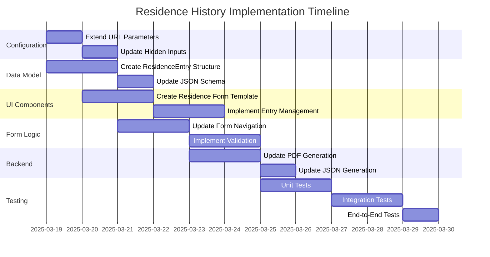

# Residence History Implementation Plan

This document outlines the implementation plan for adding the Residence History Attestation feature to the Trua Verify system.

## Overview

The Residence History Attestation feature will allow candidates to provide their residence history as part of the verification process. This feature will be optional and configurable via a URL parameter (`residenceHistoryRequired`), similar to the existing degree verification feature.

## Architecture Considerations

The current modular architecture of the Trua Verify system is well-suited for this extension. The implementation will follow the same patterns used for the employment history and degree verification features.

### Key Components to Modify

1. **Form Navigation**: Add a new step for residence history between personal information and employment history
2. **Data Model**: Add a new `ResidenceEntry` data structure
3. **Form Validation**: Implement validation rules for residence entries
4. **PDF/JSON Generation**: Update to include residence history
5. **Translations**: Add residence-related translations

## Implementation Plan



## Detailed Implementation Steps

### 1. Configuration Extension

#### 1.1 URL Parameter Handling

Add support for the `residenceHistoryRequired` parameter in the URL:

```python
# app.py
@app.route('/verify')
def verify():
    tracking_id = request.args.get('tracking_id', '')
    years = request.args.get('years', '7')
    degree_required = request.args.get('degree_required', 'false').lower() == 'true'
    residence_history_required = request.args.get('residence_history_required', 'false').lower() == 'true'
    
    return render_template('index.html', 
                          tracking_id=tracking_id, 
                          years=years, 
                          degree_required=degree_required,
                          residence_history_required=residence_history_required)
```

#### 1.2 Hidden Form Inputs

Add a hidden input to store the residence history requirement:

```html
<!-- templates/form.html -->
<input type="hidden" name="residence_history_required" value="{{ residence_history_required|lower }}">
```

### 2. Data Model Extension

#### 2.1 ResidenceEntry Structure

Create a new data structure for residence entries:

```javascript
// src/modules/residenceManagement.js
const residenceEntry = {
  address: "",
  city: "",
  state_province: "",
  zip_postal: "",
  country: "",
  start_date: "",
  end_date: "",
  is_current: false
};
```

#### 2.2 JSON Schema Update

Update the claim JSON schema to include residence history:

```javascript
// Example updated claim structure
const claim = {
  tracking_id: "abc123",
  submission_date: "2025-03-18",
  years_requested: 7,
  claimant: {
    full_name: "John Smith",
    email: "john.smith@example.com",
    phone: "555-987-6543"
  },
  residence_history: [
    {
      address: "123 Main St",
      city: "Springfield",
      state_province: "IL",
      zip_postal: "62701",
      country: "United States",
      start_date: "2023-06-01",
      end_date: null,
      is_current: true
    },
    // Additional residence entries...
  ],
  timeline: [
    // Employment entries...
  ],
  signature: "data:image/png;base64,..."
};
```

### 3. UI Components

#### 3.1 Residence Form Template

Create a new form section for residence history:

```html
<!-- templates/form.html -->
<section class="form-section" id="step-residence" data-step="2">
  <h2>Residence History</h2>
  <p>Please provide your complete residence history, beginning with your current or most recent address.</p>
  
  <div id="residence-entries-list" class="entries-list">
    <!-- Residence entries will be added here -->
  </div>
  
  <div class="form-navigation">
    <button type="button" class="button secondary prev-step" data-prev="1">Previous</button>
    <button type="button" class="button secondary" id="add-residence-btn">Add Residence</button>
    <button type="button" class="button primary next-step" id="to-next-btn" data-next="3">Next</button>
  </div>
</section>
```

#### 3.2 Residence Entry Template

Create a template for individual residence entries:

```html
<!-- templates/form.html -->
<script type="text/template" id="residence-entry-template">
  <div class="residence-entry" data-index="{index}">
    <h3>Residence #{index_plus_one}</h3>
    
    <div class="form-group">
      <label for="residence_address_{index}">Street Address <span aria-hidden="true">*</span></label>
      <input type="text" id="residence_address_{index}" name="residence_address_{index}" required>
    </div>
    
    <div class="form-group">
      <label for="residence_city_{index}">City <span aria-hidden="true">*</span></label>
      <input type="text" id="residence_city_{index}" name="residence_city_{index}" required>
    </div>
    
    <div class="form-group">
      <label for="residence_state_{index}">State/Province <span aria-hidden="true">*</span></label>
      <input type="text" id="residence_state_{index}" name="residence_state_{index}" required>
    </div>
    
    <div class="form-group">
      <label for="residence_zip_{index}">ZIP/Postal Code <span aria-hidden="true">*</span></label>
      <input type="text" id="residence_zip_{index}" name="residence_zip_{index}" required>
    </div>
    
    <div class="form-group">
      <label for="residence_country_{index}">Country <span aria-hidden="true">*</span></label>
      <select id="residence_country_{index}" name="residence_country_{index}" required>
        <option value="">Select Country</option>
        <option value="United States">United States</option>
        <!-- Additional countries... -->
      </select>
    </div>
    
    <div class="form-group">
      <label for="residence_start_date_{index}">Start Date <span aria-hidden="true">*</span></label>
      <input type="month" id="residence_start_date_{index}" name="residence_start_date_{index}" required>
    </div>
    
    <div class="form-group end-date-group">
      <label for="residence_end_date_{index}">End Date <span aria-hidden="true">*</span></label>
      <input type="month" id="residence_end_date_{index}" name="residence_end_date_{index}" required>
    </div>
    
    <div class="form-group current-residence-checkbox">
      <input type="checkbox" id="residence_is_current_{index}" name="residence_is_current_{index}">
      <label for="residence_is_current_{index}">I currently live at this address</label>
    </div>
    
    <div class="form-actions">
      <button type="button" class="button secondary remove-residence" data-index="{index}">Remove</button>
    </div>
  </div>
</script>
```

### 4. JavaScript Modules

#### 4.1 Residence Management Module

Create a new module for managing residence entries:

```javascript
// src/modules/residenceManagement.js
import { goToStep } from './formNavigation.js';
import { validateResidence } from './validation.js';

let residenceCount = 0;
let t; // Translations

export function initResidenceManagement(translations) {
  t = translations;
  
  // Add residence button
  const addResidenceBtn = document.getElementById('add-residence-btn');
  if (addResidenceBtn) {
    addResidenceBtn.addEventListener('click', function() {
      createNewResidence();
    });
  }
  
  // Save residence button
  const saveResidenceBtn = document.getElementById('save-residence-btn');
  if (saveResidenceBtn) {
    saveResidenceBtn.addEventListener('click', function(event) {
      event.preventDefault();
      saveCurrentResidence();
    });
  }
}

export function createNewResidence() {
  // Implementation similar to createNewEntry in entryManagement.js
  // ...
}

function saveCurrentResidence() {
  // Implementation similar to saveCurrentEntry in entryManagement.js
  // ...
}

// Additional functions for editing, deleting, and managing residence entries
// ...
```

#### 4.2 Form Navigation Update

Update the form navigation to include the residence history step:

```javascript
// src/modules/formNavigation.js
export function initMultiStepForm(isDegreeRequired, isResidenceRequired, translations) {
  // ...
  
  // Determine next step based on configuration
  function determineNextStep(currentStep) {
    if (currentStep === 1) {
      // After personal information
      return isResidenceRequired ? 2 : (isDegreeRequired ? 3 : 4);
    } else if (currentStep === 2 && isResidenceRequired) {
      // After residence history
      return isDegreeRequired ? 3 : 4;
    }
    // ... other step logic
  }
  
  // ...
}
```

#### 4.3 Validation Extension

Add validation for residence entries:

```javascript
// src/modules/validation.js
export function validateResidence(residenceEntry) {
  // Validate required fields
  if (!residenceEntry.address || !residenceEntry.city || 
      !residenceEntry.state_province || !residenceEntry.zip_postal || 
      !residenceEntry.country || !residenceEntry.start_date) {
    return false;
  }
  
  // Validate end date if not current residence
  if (!residenceEntry.is_current && !residenceEntry.end_date) {
    return false;
  }
  
  // Validate date order
  if (residenceEntry.start_date && residenceEntry.end_date) {
    if (new Date(residenceEntry.start_date) >= new Date(residenceEntry.end_date)) {
      return false;
    }
  }
  
  return true;
}
```

### 5. Backend Updates

#### 5.1 Form Processing

Update the form submission handler to process residence entries:

```python
# app.py
@app.route('/submit', methods=['POST'])
def submit():
    # ... existing code ...
    
    # Process residence history
    residence_history = []
    residence_keys = [k for k in request.form.keys() if k.startswith('residence_address_')]
    for key in residence_keys:
        index = key.split('_')[-1]
        residence = {
            'address': request.form.get(f'residence_address_{index}', ''),
            'city': request.form.get(f'residence_city_{index}', ''),
            'state_province': request.form.get(f'residence_state_{index}', ''),
            'zip_postal': request.form.get(f'residence_zip_{index}', ''),
            'country': request.form.get(f'residence_country_{index}', ''),
            'start_date': request.form.get(f'residence_start_date_{index}', ''),
            'end_date': request.form.get(f'residence_end_date_{index}', ''),
            'is_current': request.form.get(f'residence_is_current_{index}', '') == 'on'
        }
        residence_history.append(residence)
    
    # Add to claim data
    claim_data['residence_history'] = residence_history
    
    # ... rest of submission processing ...
```

#### 5.2 PDF Generation

Update the PDF generation to include residence history:

```python
# app.py or pdf_generator.py
def generate_pdf(claim_data):
    # ... existing code ...
    
    # Add residence history section
    if 'residence_history' in claim_data and claim_data['residence_history']:
        pdf.add_page()
        pdf.set_font('Arial', 'B', 16)
        pdf.cell(0, 10, 'Residence History', 0, 1, 'L')
        pdf.ln(5)
        
        for residence in claim_data['residence_history']:
            pdf.set_font('Arial', 'B', 12)
            address_line = f"{residence['address']}, {residence['city']}, {residence['state_province']} {residence['zip_postal']}, {residence['country']}"
            pdf.cell(0, 10, address_line, 0, 1, 'L')
            
            pdf.set_font('Arial', '', 12)
            date_range = f"From: {residence['start_date']} To: {'Present' if residence['is_current'] else residence['end_date']}"
            pdf.cell(0, 10, date_range, 0, 1, 'L')
            pdf.ln(5)
    
    # ... rest of PDF generation ...
```

### 6. Translations

Add residence-related translations to all supported languages:

```javascript
// Example English translations
const residenceTranslations = {
  residenceHistory: "Residence History",
  address: "Street Address",
  city: "City",
  stateProvince: "State/Province/Region",
  zipPostal: "ZIP / Postal Code",
  country: "Country",
  currentResidence: "I currently live at this address",
  addResidence: "Add Another Residence",
  pleaseAddResidence: "Please add at least one residence.",
  residenceDatesOverlap: "Please ensure residence dates are in correct chronological order and do not overlap."
};
```

### 7. Testing

#### 7.1 Unit Tests

Create unit tests for the residence management module:

```javascript
// src/modules/__tests__/residenceManagement.test.js
describe('Residence Management', () => {
  test('should validate residence entry correctly', () => {
    // Test validation logic
  });
  
  test('should create new residence entry', () => {
    // Test creation logic
  });
  
  // Additional tests...
});
```

#### 7.2 End-to-End Tests

Create Cypress tests for the residence history feature:

```javascript
// cypress/e2e/residence.cy.js
describe('Residence History Form', () => {
  beforeEach(() => {
    // Visit with residence history required
    cy.visit('/?residence_history_required=true');
  });
  
  it('should add and validate residence entries', () => {
    // Fill out personal information
    // ...
    
    // Add residence entry
    cy.get('#add-residence-btn').click();
    cy.get('#residence_address_0').type('123 Main St');
    cy.get('#residence_city_0').type('Springfield');
    // ... more fields
    cy.get('#save-residence-btn').click();
    
    // Verify entry was added
    cy.get('#residence-entries-list').should('contain', '123 Main St');
    
    // Proceed to next step
    cy.get('#to-next-btn').click();
    // ... rest of test
  });
});
```

## Technical Considerations

1. **Backward Compatibility**: The `residenceHistoryRequired` parameter defaults to false to ensure existing implementations continue to work.

2. **Performance**: The additional step and data should have minimal impact on performance, but we should monitor page load times and form submission size.

3. **Accessibility**: All new form elements will have proper ARIA attributes and keyboard navigation.

4. **Mobile Responsiveness**: The residence form will be tested on various screen sizes.

5. **Error Handling**: Clear error messages will be implemented for residence-specific validation issues.

## Timeline

- **Phase 1 (2-3 days)**: Configuration, data model, and basic module structure
- **Phase 2 (3-4 days)**: UI components, form navigation, and validation
- **Phase 3 (2-3 days)**: PDF/JSON generation and translations
- **Phase 4 (2 days)**: Testing and bug fixes

Total estimated time: 9-12 days