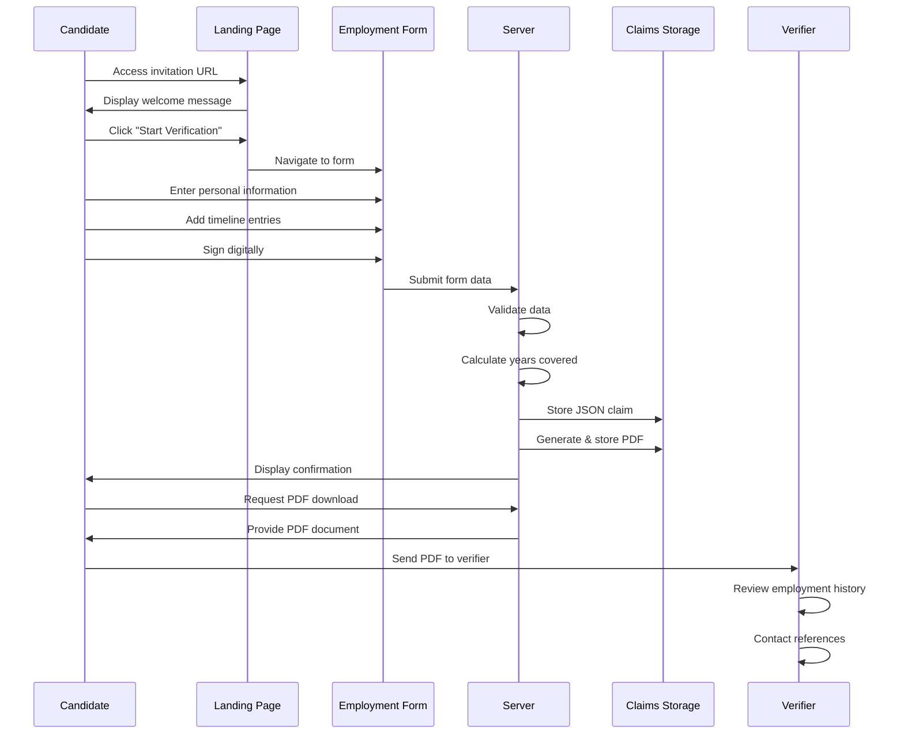
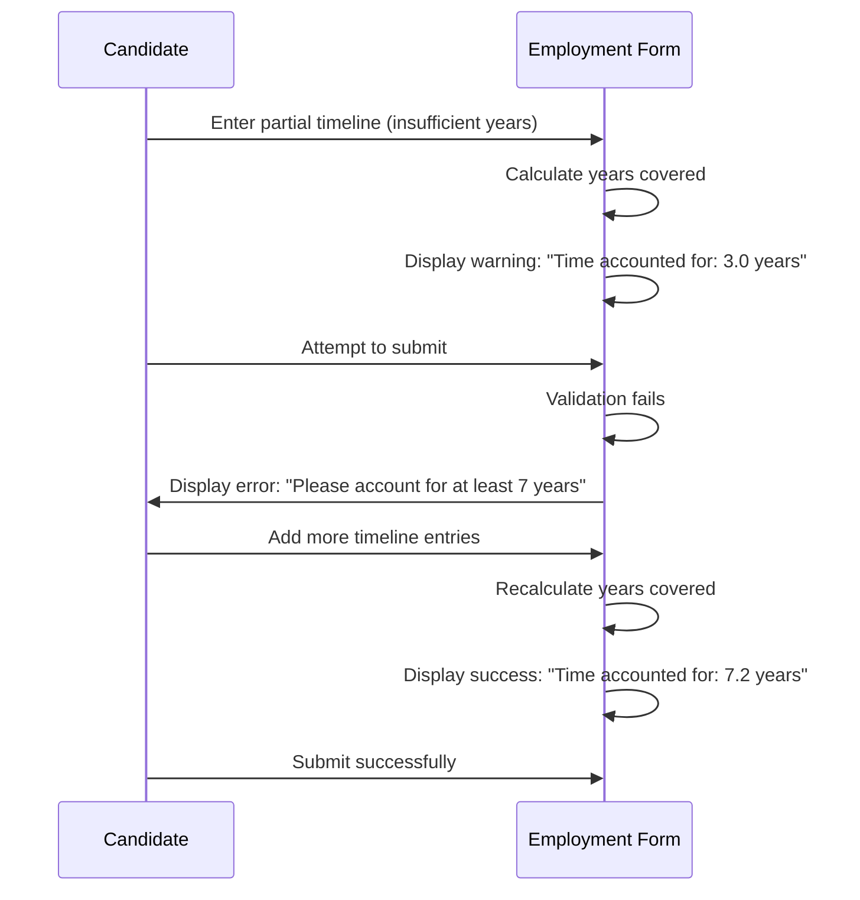
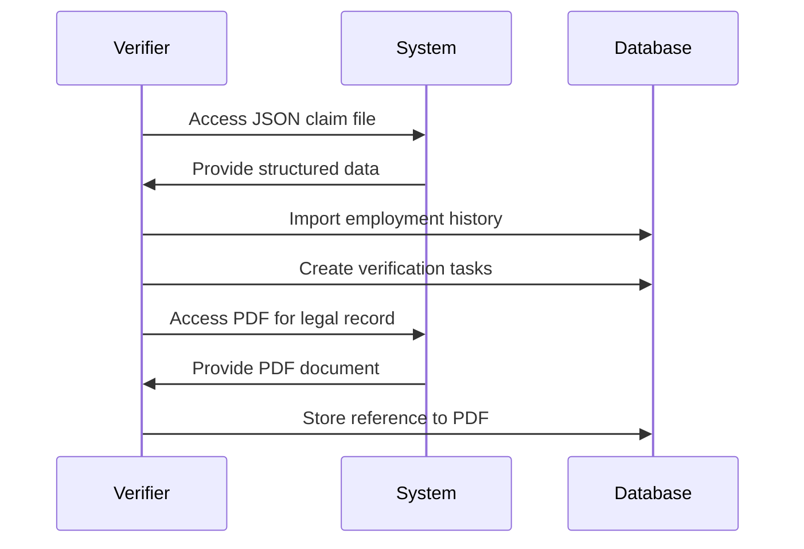

# Trua Verify Sequence Diagram

This document illustrates the sequence of interactions between the actors and system components in the Trua Verify application.

## Main Flow Sequence Diagram

## Detailed Sequence Descriptions

### 1. Initial Access and Navigation

1. **Candidate Accesses URL**:
   - Candidate clicks on invitation link with tracking_id and years parameters
   - Browser sends GET request to `/verify` endpoint

2. **Landing Page Display**:
   - Server processes request parameters
   - Server renders landing page template with tracking_id and years
   - Browser displays welcome message and explanation

3. **Navigation to Form**:
   - Candidate clicks "Start Verification" button
   - Browser sends GET request to `/form` endpoint with parameters
   - Server renders form template
   - Browser displays employment form

### 2. Form Completion

1. **Personal Information Entry**:
   - Candidate fills out personal information fields
   - Client-side validation checks required fields
   - Form updates attestation name in real-time

2. **Timeline Entry Addition**:
   - Candidate clicks "Add Entry" button
   - JavaScript adds new entry form fields
   - Candidate fills entry details
   - JavaScript updates time accounted calculation
   - Process repeats for multiple entries until timeframe is covered

3. **Digital Signature**:
   - Candidate draws signature on canvas
   - JavaScript captures signature as data URL
   - Client-side validation confirms signature presence

### 3. Form Submission and Processing

1. **Form Submission**:
   - Candidate clicks "Submit" button
   - JavaScript performs final validation
   - JavaScript adds signature data to hidden field
   - Browser sends POST request to `/submit` endpoint with form data

2. **Server-side Processing**:
   - Server receives form data
   - Server parses timeline entries
   - Server creates claim data structure
   - Server generates unique filenames based on tracking_id and date

3. **Document Generation**:
   - Server creates JSON representation of claim
   - Server writes JSON to claims directory
   - Server generates PDF document with ReportLab
   - Server writes PDF to claims directory

4. **Confirmation Display**:
   - Server renders confirmation template with download link
   - Browser displays confirmation page to candidate

### 4. Document Retrieval and Verification

1. **PDF Download**:
   - Candidate clicks "Download PDF" button
   - Browser sends GET request to `/download/<filename>` endpoint
   - Server retrieves PDF from claims directory
   - Server sends PDF as attachment
   - Browser downloads PDF to candidate's device

2. **External Verification Process**:
   - Candidate sends PDF to verifier (email, upload, etc.)
   - Verifier reviews PDF document
   - Verifier contacts references listed in timeline
   - Verifier confirms employment details

## Alternative Flows

### Incomplete Submission Flow

### Programmatic Processing Flow

## Implementation Notes

The current implementation fully supports the main flow and incomplete submission flow. The programmatic processing flow is supported through the generation of JSON files, but the actual integration with external systems would be implemented by the verifier.

The sequence diagrams highlight the clear separation between client-side and server-side responsibilities, with client-side handling most of the validation and user interaction, while the server focuses on data processing and document generation.