# Trua Verify State Machine

This document outlines the state machine that drives the Trua Verify collection flow. The state machine defines the possible states of the application and the transitions between them.

## State Machine Diagram

```mermaid
stateDiagram-v2
   [*] --> idle
   idle --> collectingKey : START


   %% Initial Key Collection
   collectingKey --> parsingKey : NEXT
   parsingKey --> personalInfo : PARSE [language = key.slice(0,2); bits = parseInt(key.slice(2),2)]
   %% Callout: Parses hybrid key (e.g., "en000000111111"); sets language; bits drive steps (2-7)


   %% Core Step
   personalInfo --> consentCapture : SUBMIT [name && email]
   %% Callout: Collects name, DOB, email, phone, SSN (optional)


   %% Consent Capture
   state consentCapture {
       [*] --> collectDriverLicense
       collectDriverLicense --> driverLicense : YES [bits & 2]
       collectDriverLicense --> collectDrugTest : NO
       driverLicense --> collectDrugTest : SUBMIT
       collectDrugTest --> drugTest : YES [bits & 4]
       collectDrugTest --> collectBiometric : NO
       drugTest --> collectBiometric : SUBMIT
       collectBiometric --> biometric : YES [bits & 8]
       collectBiometric --> [*] : NO
       biometric --> [*] : SUBMIT
   }
   consentCapture --> education : SUBMIT [all required consents valid]
   consentCapture --> education : NEXT [bits & 14 = 0]
   %% Callout: Collects consents sequentially if enabled by bits 1-3


   %% Education
   state education {
       [*] --> level
       level --> degree : YES [level >= Bachelor's]
       level --> [*] : NO
       degree --> [*] : SUBMIT
   }
   education --> professionalLicense : SUBMIT [!bits & 16 || level && (level < Bachelor's || degree)]
   education --> professionalLicense : NEXT [!bits & 16]
   %% Callout: Optional; collects highest level; degree + date if college+


   %% Professional License
   state professionalLicense {
       [*] --> collecting
       collecting --> collecting : ADD_ANOTHER
       collecting --> [*] : DONE
   }
   professionalLicense --> residenceHistory : NEXT [!bits & 32 || licenses.length > 0]
   %% Callout: Optional; iteratively collects license type, number, issuer, dates


   %% Residence History
   state residenceHistory {
       [*] --> simpleEntry
       simpleEntry --> guidedEntry : NEXT [totalYears < requiredYears(bits, 7)]
       simpleEntry --> completeEntry : NEXT [totalYears >= requiredYears(bits, 7)]
       guidedEntry --> guidedEntry : ADD [!timelineComplete]
       guidedEntry --> completeEntry : NEXT [timelineComplete]
       completeEntry --> [*] : NEXT
   }
   residenceHistory --> employmentHistory : NEXT [!bits & 1024]
   %% Callout: Optional; simple → guided → complete; collects timeline (0=1, 3=3 yrs, 5=5 yrs, 7=7 yrs, 10=10 yrs)


   %% Employment History
   state employmentHistory {
       [*] --> simpleEntry
       simpleEntry --> guidedEntry : NEXT [totalYears < requiredYears(bits, 11)]
       simpleEntry --> completeEntry : NEXT [totalYears >= requiredYears(bits, 11)]
       guidedEntry --> guidedEntry : ADD [!timelineComplete]
       guidedEntry --> completeEntry : NEXT [timelineComplete]
       completeEntry --> [*] : NEXT
   }
   employmentHistory --> eSignature : NEXT [!bits & 2048]
   %% Callout: Optional; simple → guided → complete; collects timeline (0=1, 3=3 yrs, 5=5 yrs, 7=7 yrs, 10=10 yrs)


   %% Finalization
   eSignature --> generatingArtifacts : SUBMIT [signature]
   generatingArtifacts --> confirmation : NEXT
   confirmation --> done : DOWNLOAD
   done --> [*]
   %% Callout: eSignature confirms; generates JSON/PDF; offers download
```



## State Descriptions

### Initial States

1. **idle**
   - Initial state when the application is loaded
   - Transitions to `collectingKey` when the user starts the process

2. **collectingKey**
   - Collects the collection key from the URL or user input
   - Transitions to `parsingKey` when the key is collected

3. **parsingKey**
   - Parses the collection key to extract language and configuration bits
   - Transitions to `personalInfo` when parsing is complete

### Core Steps

4. **personalInfo**
   - Collects personal information (name, DOB, email, phone, SSN)
   - Validates required fields (name and email)
   - Transitions to `consentCapture` when valid information is submitted

### Consent Capture

5. **consentCapture**
   - Composite state for collecting required consents
   - Contains sub-states for each consent type:
     - **collectDriverLicense**: Determines if driver's license consent is required
     - **driverLicense**: Collects driver's license consent if required
     - **collectDrugTest**: Determines if drug test consent is required
     - **drugTest**: Collects drug test consent if required
     - **collectBiometric**: Determines if biometric consent is required
     - **biometric**: Collects biometric consent if required
   - Transitions to `education` when all required consents are collected or if no consents are required

### Education

6. **education**
   - Composite state for collecting education information
   - Contains sub-states:
     - **level**: Collects highest education level
     - **degree**: Collects degree details if level is Bachelor's or higher
   - Transitions to `professionalLicense` when education information is submitted or if education is not required

### Professional License

7. **professionalLicense**
   - Composite state for collecting professional license information
   - Contains sub-states:
     - **collecting**: Iteratively collects license information
   - Supports adding multiple licenses with the `ADD_ANOTHER` transition
   - Transitions to `residenceHistory` when license collection is complete or if licenses are not required

### Residence History

8. **residenceHistory**
   - Composite state for collecting residence history
   - Contains sub-states:
     - **simpleEntry**: Initial entry state
     - **guidedEntry**: Guided entry if timeline is incomplete
     - **completeEntry**: Final state when timeline is complete
   - Transitions to `employmentHistory` when residence history is complete or if residence history is not required

### Employment History

9. **employmentHistory**
   - Composite state for collecting employment history
   - Contains sub-states:
     - **simpleEntry**: Initial entry state
     - **guidedEntry**: Guided entry if timeline is incomplete
     - **completeEntry**: Final state when timeline is complete
   - Transitions to `eSignature` when employment history is complete or if employment history is not required

### Finalization

10. **eSignature**
    - Collects digital signature
    - Transitions to `generatingArtifacts` when signature is submitted

11. **generatingArtifacts**
    - Generates JSON and PDF artifacts
    - Transitions to `confirmation` when artifacts are generated

12. **confirmation**
    - Displays confirmation message and download link
    - Transitions to `done` when download is initiated

13. **done**
    - Final state when the process is complete

## Transition Conditions

### Bit-Based Conditions

The state machine uses bit flags from the collection key to determine transitions:

- **bits & 2**: Driver's license consent required (bit 1)
- **bits & 4**: Drug test consent required (bit 2)
- **bits & 8**: Biometric consent required (bit 3)
- **bits & 16**: Education required (bit 4)
- **bits & 32**: Professional licenses required (bit 5)
- **bits & 64**: Residence history required (bit 6)
- **bits & 1024**: Employment history required (bit 10)

### Timeline Completion Conditions

For residence and employment history:

- **totalYears < requiredYears(bits, 7)**: Residence timeline is incomplete
- **totalYears >= requiredYears(bits, 7)**: Residence timeline is complete
- **totalYears < requiredYears(bits, 11)**: Employment timeline is incomplete
- **totalYears >= requiredYears(bits, 11)**: Employment timeline is complete

The `requiredYears` function calculates the required years based on the bits:

```typescript
function requiredYears(bits: number, startPosition: number): number {
  const timelineBits = (bits >> startPosition) & 0b111; // Extract 3 bits starting at position
  switch (timelineBits) {
    case 0: return 1;  // 000
    case 3: return 3;  // 011
    case 5: return 5;  // 101
    case 7: return 7;  // 111
    case 5: return 10; // 101 (same as 5 years, context determines)
    default: return 1;
  }
}
```

## TypeScript Implementation

The state machine can be implemented using a finite state machine library like XState or a custom implementation:

```typescript
// State types
export type FormState =
  | 'idle'
  | 'collectingKey'
  | 'parsingKey'
  | 'personalInfo'
  | 'consentCapture'
  | 'education'
  | 'professionalLicense'
  | 'residenceHistory'
  | 'employmentHistory'
  | 'eSignature'
  | 'generatingArtifacts'
  | 'confirmation'
  | 'done';

// Consent capture sub-states
export type ConsentCaptureState =
  | 'collectDriverLicense'
  | 'driverLicense'
  | 'collectDrugTest'
  | 'drugTest'
  | 'collectBiometric'
  | 'biometric';

// Education sub-states
export type EducationState =
  | 'level'
  | 'degree';

// Professional license sub-states
export type ProfessionalLicenseState =
  | 'collecting';

// Residence history sub-states
export type ResidenceHistoryState =
  | 'simpleEntry'
  | 'guidedEntry'
  | 'completeEntry';

// Employment history sub-states
export type EmploymentHistoryState =
  | 'simpleEntry'
  | 'guidedEntry'
  | 'completeEntry';

// Event types
export type FormEvent =
  | { type: 'START' }
  | { type: 'NEXT' }
  | { type: 'SUBMIT', data: any }
  | { type: 'ADD_ANOTHER' }
  | { type: 'DONE' }
  | { type: 'ADD' }
  | { type: 'DOWNLOAD' };

// State machine context
export interface FormContext {
  collectionKey: string;
  language: string;
  bits: number;
  personalInfo: any;
  consents: any;
  education: any;
  professionalLicenses: any[];
  residenceHistory: any[];
  employmentHistory: any[];
  signature: string;
  totalResidenceYears: number;
  totalEmploymentYears: number;
}

// Example transition function
function transition(state: FormState, event: FormEvent, context: FormContext): FormState {
  switch (state) {
    case 'idle':
      if (event.type === 'START') return 'collectingKey';
      break;
    case 'collectingKey':
      if (event.type === 'NEXT') return 'parsingKey';
      break;
    case 'parsingKey':
      if (event.type === 'NEXT') return 'personalInfo';
      break;
    case 'personalInfo':
      if (event.type === 'SUBMIT' && event.data.name && event.data.email) {
        return 'consentCapture';
      }
      break;
    // ... additional transitions
  }
  return state;
}
```

## Integration with React

The state machine can be integrated with React using hooks:

```typescript
// Custom hook for form state machine
function useFormStateMachine(initialContext: FormContext) {
  const [state, setState] = useState<FormState>('idle');
  const [context, setContext] = useState<FormContext>(initialContext);

  const send = useCallback((event: FormEvent) => {
    const nextState = transition(state, event, context);
    setState(nextState);
    
    // Update context based on event
    if (event.type === 'SUBMIT') {
      setContext(prevContext => ({
        ...prevContext,
        ...event.data
      }));
    }
  }, [state, context]);

  return { state, context, send };
}

// Usage in a component
function FormContainer() {
  const { state, context, send } = useFormStateMachine({
    collectionKey: '',
    language: 'en',
    bits: 0,
    personalInfo: {},
    consents: {},
    education: {},
    professionalLicenses: [],
    residenceHistory: [],
    employmentHistory: [],
    signature: '',
    totalResidenceYears: 0,
    totalEmploymentYears: 0
  });

  // Render different components based on state
  const renderContent = () => {
    switch (state) {
      case 'personalInfo':
        return <PersonalInfoForm onSubmit={data => send({ type: 'SUBMIT', data })} />;
      case 'consentCapture':
        return <ConsentCaptureForm onSubmit={data => send({ type: 'SUBMIT', data })} />;
      // ... additional states
      default:
        return null;
    }
  };

  return (
    <div className="form-container">
      {renderContent()}
    </div>
  );
}
```

## Benefits of the State Machine Approach

1. **Clear Visualization**: The state diagram provides a clear visualization of the application flow.
2. **Predictable Transitions**: State transitions are explicit and predictable.
3. **Separation of Concerns**: The state machine separates the application logic from the UI components.
4. **Testability**: State transitions can be tested independently of the UI.
5. **Maintainability**: The state machine makes it easier to understand and maintain the application flow.

## Considerations for Implementation

1. **State Persistence**: Consider persisting the state and context to allow users to resume their progress.
2. **Error Handling**: Add error states and transitions to handle validation errors and API failures.
3. **Loading States**: Add loading states for asynchronous operations like API calls.
4. **Accessibility**: Ensure that the state machine supports keyboard navigation and screen readers.
5. **Analytics**: Add analytics tracking to state transitions to monitor user behavior.