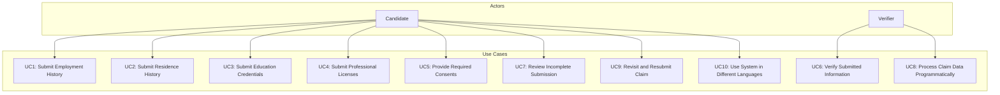

# Trua Verify Use Case Diagram

This document outlines the primary use cases for the Trua Verify system and how they relate to the system actors.

## Use Case Diagram

## Detailed Use Cases

### UC1: Submit Employment History

**Actor**: Candidate

**Goal**: Submit a complete, signed employment history for a specified timeframe as part of a verification process.

**Preconditions**:
- Candidate receives an invitation link from the Verifier with tracking_id and requirements configuration.
- System is accessible via a web browser.

**Steps**:
1. Candidate clicks the invitation link, loading the Trua Verify form with tracking_id pre-filled.
2. Candidate completes the personal information and consents steps.
3. Candidate navigates to the employment history step.
4. Candidate adds timeline entries:
   - Job: "Product Manager at Nexlify, 2020-06-01 to 2023-05-31" with contact "Jane Doe (Supervisor, Senior Engineering Manager), 555-123-4567, jane.doe@nexlify.com".
   - Job: "Consultant at Freelance, 2019-01-01 to 2020-05-31" with contact "John Smith (Client, Project Lead), john.smith@clientco.com".
   - Gap: "Unemployed, 2018-03-01 to 2018-12-31".
   - Job: "Junior Developer at TechCorp, 2015-03-01 to 2018-02-28" with contact "Mike Johnson (Team Lead), mike.johnson@techcorp.com".
5. System calculates and displays "Time accounted for: 10.25 years," confirming coverage of the required 10 years.
6. Candidate completes any remaining steps and signs digitally on the canvas, certifying accuracy.
7. Candidate submits the form.
8. System generates and saves a PDF and JSON in the claims directory.
9. Candidate downloads the PDF and sends it to the Verifier as instructed.

**Postconditions**:
- Employment history is stored in the claim with completion timestamp.
- Candidate has a PDF copy for their records.

**Exceptions**:
- If timeframe isn't covered (e.g., "8.5 years" when 10 are required), system alerts: "Please account for at least 10 years."
- If required fields are missing, submission fails with an error.

### UC2: Submit Residence History

**Actor**: Candidate

**Goal**: Provide residence history information as part of the verification process.

**Preconditions**:
- Candidate is filling out the Trua Verify form via an invitation link with residence history verification enabled.

**Steps**:
1. Candidate completes personal information and consents steps.
2. System presents the residence history step.
3. Candidate enters current residence:
   - Address: "123 Main St"
   - City: "Springfield"
   - State/Province: "IL"
   - ZIP/Postal Code: "62701"
   - Country: "United States"
   - Start Date: "2023-06-01"
   - Checks "I currently live at this address"
4. Candidate adds previous residences:
   - Address: "456 Oak Ave", City: "Chicago", State/Province: "IL", ZIP/Postal Code: "60601", Country: "United States", Start Date: "2020-06-01", End Date: "2023-05-31"
   - Address: "789 Pine Rd", City: "Naperville", State/Province: "IL", ZIP/Postal Code: "60540", Country: "United States", Start Date: "2018-01-01", End Date: "2020-05-31"
5. System calculates and displays "Time accounted for: 7.25 years," confirming coverage of the required 5 years.
6. Candidate proceeds to the next step.

**Postconditions**:
- Residence history is included in the claim with completion timestamp.

**Exceptions**:
- If required residence fields are missing, submission fails with an error.
- If residence dates overlap, system alerts the candidate to correct the dates.
- If timeframe isn't covered, system alerts: "Please account for at least 5 years."

### UC3: Submit Education Credentials

**Actor**: Candidate

**Goal**: Provide education verification information as part of the verification process.

**Preconditions**:
- Candidate is filling out the Trua Verify form via an invitation link with education verification enabled.

**Steps**:
1. Candidate completes previous steps in the form.
2. System presents the education verification step.
3. Candidate enters education details:
   - Highest Level: "Bachelor's"
   - School Name: "University of Illinois"
   - Degree Level: "Bachelor's"
   - Degree Title: "Bachelor of Science"
   - Major: "Computer Science"
   - Award Date: "2018-05-15"
   - GPA: "3.8"
4. Candidate proceeds to the next step.

**Postconditions**:
- Education credentials are included in the claim with completion timestamp.

**Exceptions**:
- If required education fields are missing, submission fails with an error.

### UC4: Submit Professional Licenses

**Actor**: Candidate

**Goal**: Provide professional license information as part of the verification process.

**Preconditions**:
- Candidate is filling out the Trua Verify form via an invitation link with professional license verification enabled.

**Steps**:
1. Candidate completes previous steps in the form.
2. System presents the professional licenses step.
3. Candidate adds a professional license:
   - Category: "Project Management"
   - Type: "Certified ScrumMaster"
   - Class: "CSM"
   - Identifier: "CSM-987654"
   - Identifier Descriptor: "Scrum Alliance Certification Number"
   - Issuer: "Scrum Alliance"
   - Issue Date: "2020-01-15"
   - Expiration Date: "2026-01-14"
   - Status: "active"
   - Notes: "Used in product management role"
4. Candidate adds another professional license:
   - Category: "Project Management"
   - Type: "Project Management Professional"
   - Class: "PMP"
   - Identifier: "PMP-123456"
   - Identifier Descriptor: "PMI Certification ID"
   - Issuer: "Project Management Institute (PMI)"
   - Issue Date: "2019-03-10"
   - Expiration Date: "2025-03-09"
   - Status: "active"
   - Notes: "Maintained through annual PDU requirements"
5. Candidate proceeds to the next step.

**Postconditions**:
- Professional licenses are included in the claim with completion timestamp.

**Exceptions**:
- If required license fields are missing, submission fails with an error.

### UC5: Provide Required Consents

**Actor**: Candidate

**Goal**: Provide necessary consents for various verification processes.

**Preconditions**:
- Candidate is filling out the Trua Verify form via an invitation link with specific consent requirements.

**Steps**:
1. Candidate completes the personal information step.
2. System presents the consents step with required consents based on the configuration.
3. Candidate reviews and grants driver's license consent:
   - Checks "I consent to a DMV record check"
   - System records consent with timestamp
4. Candidate declines drug test consent:
   - Leaves "I consent to drug testing" unchecked
   - System records declined consent
5. Candidate reviews and grants biometric consent:
   - Checks "I consent to biometric data collection"
   - System records consent with timestamp
6. Candidate proceeds to the next step.

**Postconditions**:
- Consent records are included in the claim with completion timestamp.

**Exceptions**:
- If required consents are not granted, system alerts the candidate that these consents are necessary to proceed.

### UC6: Verify Submitted Information

**Actor**: Verifier

**Goal**: Confirm the candidate's submitted information using the claim.

**Preconditions**:
- Verifier has provided the tracking_id in the invitation with specific verification requirements.
- Candidate has submitted the claim, and the PDF is received.

**Steps**:
1. Verifier opens the PDF and reviews all sections:
   - Personal information
   - Granted consents
   - Employment history
   - Residence history
   - Education credentials
   - Professional licenses
   - Digital signature
2. Verifier contacts employment references to verify job details.
3. Verifier checks residence addresses through appropriate means.
4. Verifier verifies education credentials with the institution.
5. Verifier confirms professional license status with issuing organizations.
6. Verifier documents verification results.

**Postconditions**:
- All submitted information is validated for the verification process.

**Exceptions**:
- If verification fails for any section, Verifier may request additional documentation from the candidate.

### UC7: Review Incomplete Submission Attempt

**Actor**: Candidate

**Goal**: Understand and correct an incomplete submission to meet the requirements.

**Preconditions**:
- Candidate is filling out the Trua Verify form via an invitation link.

**Steps**:
1. Candidate enters personal information and proceeds through the form.
2. In the employment history step, Candidate adds only one job covering 3 years (for a 10-year requirement).
3. System shows "Time accounted for: 3.0 years" (for a 10-year timeframe).
4. Candidate attempts to proceed.
5. System alerts: "Please account for at least 10 years."
6. Candidate adds more entries to reach 10+ years.
7. Candidate proceeds successfully.

**Postconditions**:
- Each section is only marked complete when all requirements are met.

**Exceptions**:
- Candidate abandons the process if unable to meet requirements, requiring Verifier follow-up.

### UC8: Process Claim Data Programmatically

**Actor**: Verifier

**Goal**: Import the claim data into an HR or verification system using the JSON file.

**Preconditions**:
- Candidate has submitted the claim.
- Verifier has access to the claims directory.

**Steps**:
1. Verifier retrieves the JSON file from claims.
2. System parses JSON:
   - Extracts all sections of the claim
   - Loads data into a database or tool
3. Verifier uses data to:
   - Auto-populate candidate profile
   - Generate verification tasks
   - Track verification progress
4. Verifier stores the PDF as a legal record alongside the processed data.

**Postconditions**:
- Claim data is integrated into Verifier's system efficiently.

**Exceptions**:
- If JSON is malformed (unlikely with server generation), Verifier falls back to PDF manual review.

### UC9: Revisit and Resubmit Claim

**Actor**: Candidate

**Goal**: Correct or update information before final submission to the Verifier.

**Preconditions**:
- Candidate is in the Trua Verify form, having completed some sections.

**Steps**:
1. Candidate completes several sections of the form.
2. Candidate realizes a mistake in the employment history.
3. Candidate navigates back to the employment history step.
4. Candidate edits the incorrect entry.
5. System recalculates years covered and updates the display.
6. Candidate proceeds through remaining steps and submits.

**Postconditions**:
- Only the final, corrected claim is stored.

**Exceptions**:
- If Verifier already received an earlier PDF, Candidate must notify them of the update.

### UC10: Use System in Different Languages

**Actor**: Candidate

**Goal**: Complete the verification process in the candidate's preferred language.

**Preconditions**:
- Candidate is accessing the Trua Verify form.

**Steps**:
1. Candidate views the form in the default language (English).
2. Candidate selects a different language from the language switcher (e.g., Spanish).
3. System updates all text, labels, and messages to the selected language.
4. Candidate completes the form in their preferred language.
5. System generates the PDF in the selected language.

**Postconditions**:
- Claim is submitted and stored with the language preference noted.
- PDF is generated in the candidate's preferred language.

**Exceptions**:
- If translations are incomplete, some text may remain in the default language.

## Use Case Implementation Status

| Use Case | Implementation Status | Notes |
|----------|----------------------|-------|
| UC1: Submit Employment History | ✅ Fully Implemented | Core functionality with TypeScript support |
| UC2: Submit Residence History | ✅ Fully Implemented | Includes duration calculation |
| UC3: Submit Education Credentials | ✅ Fully Implemented | Collects comprehensive degree information |
| UC4: Submit Professional Licenses | ✅ Fully Implemented | Supports multiple license entries |
| UC5: Provide Required Consents | ✅ Fully Implemented | Configurable consent requirements |
| UC6: Verify Submitted Information | ⚠️ Partially Implemented | PDF/JSON generation supports this, but verification is manual outside the system |
| UC7: Review Incomplete Submission | ✅ Fully Implemented | Form validation prevents submission until requirements met |
| UC8: Process Claim Data Programmatically | ✅ Fully Implemented | TypeScript interfaces support programmatic processing |
| UC9: Revisit and Resubmit Claim | ✅ Fully Implemented | Form allows editing before submission |
| UC10: Use System in Different Languages | ✅ Fully Implemented | Language switcher and translations are implemented |

## Future Use Case Considerations

Additional use cases that could be implemented in future versions:

1. **UC11: Verifier Requests Resubmission** - Allow verifiers to request corrections or additional information.
2. **UC12: System Administrator Reviews Claims** - Add administrative oversight for compliance and quality control.
3. **UC13: Candidate Views Submission History** - Allow candidates to see their previous submissions.
4. **UC14: Verifier Manages Multiple Claims** - Provide a dashboard for verifiers to track multiple verification processes.
5. **UC15: Candidate Saves Draft** - Allow candidates to save their progress and return later.
6. **UC16: System Performs Automated Verification** - Implement automated verification for certain data points.
7. **UC17: Candidate Uploads Supporting Documents** - Allow candidates to upload documents to support their claims.